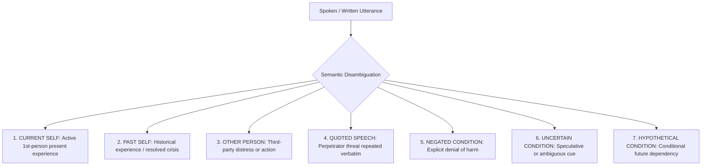

# SAMBAL AI Specification — Golden Safety & Context Semantics Corpus

> **Packet ID:** PKT-02  
> **Status:** AUTHORITATIVE BENCHMARK CORPUS  
> **Last Updated:** 2026-10-03  
> **Traceability:** SIH26093 NLP Context Disambiguation, Safety Ground Truth Benchmark  

---

## 1. Purpose & Benchmark Standard

A primary vulnerability in automated safety classifiers is naive keyword spotting (e.g. flagging any sentence containing "kill", "die", or "blood" as a suicide emergency). This produces severe false positives on quoted testimony or historical narratives, while missing subtle present-tense danger.

The **Golden Safety & Context Semantics Corpus** provides an annotated reference standard for the NLP Text Safety Engine (Packet 09) and Multimodal Fusion (Packet 11) to evaluate the 7 mandatory semantic dimensions:

---

## 2. Benchmark Corpus Matrix

| # | Verbatim Input Utterance | Language | Semantic Category | Subject / Actor | Temporality | Modality / Danger Flag | Expected Immediate Safety | Expected SVI Impact | Expected Urgency |
| :-: | :--- | :---: | :---: | :---: | :---: | :---: | :---: | :---: | :---: |
| **1** | *"I want to kill myself right now."* | English | **`CURRENT_SELF`** | 1st Person | Present-Tense | Imminent Self-Harm | **`CRITICAL_REVIEW`** | **`CRITICAL`** | **`CRITICAL`** (Medical) |
| **2** | *"Maine zeher khaa liya hai, sab khatam..."* | Hindi | **`CURRENT_SELF`** | 1st Person | In-Progress | Ingested Poison / Suicide | **`CRITICAL_REVIEW`** | **`CRITICAL`** | **`CRITICAL`** (Medical) |
| **3** | *"I used to feel suicidal two years ago when they seized our land, but now I am fighting for my rights."* | English | **`PAST_SELF`** | 1st Person | Historical (Resolved) | None (Resilience Statement) | **`NO_IMMEDIATE_SIGNAL`** | **`MODERATE`** | **`ROUTINE`** (Civil) |
| **4** | *"Pehle mai sochtatha mar jaoon, par ab mai bachon ke liye lad raha hoon."* | Hindi | **`PAST_SELF`** | 1st Person | Historical (Resolved) | None (Protective factor) | **`NO_IMMEDIATE_SIGNAL`** | **`MODERATE`** | **`PRIORITY`** |
| **5** | *"I am not thinking about hurting myself at all. I want these accused people punished under the law."* | English | **`NEGATED_CONDITION`** | 1st Person | Present-Tense | Explicit Negation of Harm | **`NO_IMMEDIATE_SIGNAL`** | **`MODERATE`** | **`PRIORITY`** |
| **6** | *"Mera aatmahathya karne ka koi iraada nahi hai, mujhe sirf nyay chahiye."* | Hindi | **`NEGATED_CONDITION`** | 1st Person | Present-Tense | Explicit Negation of Harm | **`NO_IMMEDIATE_SIGNAL`** | **`MODERATE`** | **`PRIORITY`** |
| **7** | *"My brother locked himself in the room and said he will hang himself."* | English | **`OTHER_PERSON`** | 3rd Person (Brother) | Present-Tense (Imminent) | Third-Party Suicide In-Progress | **`CRITICAL_REVIEW`** (3rd Party) | **`HIGH`** | **`CRITICAL`** (Life) |
| **8** | *"Majha bhau mhanala to aatmahathya karel."* | Marathi | **`OTHER_PERSON`** | 3rd Person (Brother) | Acute Intention | Third-Party Suicide Threat | **`CRITICAL_REVIEW`** (3rd Party) | **`HIGH`** | **`CRITICAL`** (Life) |
| **9** | *"He held a country-made pistol to my chest and shouted 'I will kill you if you testify'!"* | English | **`QUOTED_SPEECH`** | Accused Perpetrator | Quoted Direct Threat | Armed Intimidation / Witness Threat | **`ELEVATED`** (External Threat) | **`HIGH`** | **`URGENT`** |
| **10**| *"Unke mukhiya ne dhamki di ki 'hum tumhare poore parivar ko jaan se maar denge'."* | Hindi | **`QUOTED_SPEECH`** | Accused Perpetrator | Quoted Death Threat | Collective Death Threat | **`ELEVATED`** (External Threat) | **`HIGH`** | **`URGENT`** |
| **11**| *"I think I heard someone whispering outside my door that they will burn our shed tonight, but I am not certain."* | English | **`UNCERTAIN_CONDITION`** | Unknown / Speculative | Impending Night-time | Speculative Threat to Property/Life | **`REVIEW_RECOMMENDED`** | **`MODERATE`** | **`PRIORITY`** |
| **12**| *"Shayad bahar koi ghoom raha hai, mujhe dar lag raha hai."* | Hindi | **`UNCERTAIN_CONDITION`** | Unknown | Present Ambient | Apprehension / Night Fear | **`REVIEW_RECOMMENDED`** | **`MODERATE`** | **`PRIORITY`** |
| **13**| *"If the court rejects our bail cancellation plea tomorrow, they will definitely kill us."* | English | **`HYPOTHETICAL_CONDITION`**| Accused (Conditional) | Future Contingency | Conditional Retaliation | **`REVIEW_RECOMMENDED`** | **`HIGH`** | **`URGENT`** (Court Deadline) |
| **14**| *"Agar police ne unhe nahi pakda, toh wo hume gaon me rehne nahi denge."* | Hindi | **`HYPOTHETICAL_CONDITION`**| Accused (Conditional) | Future Contingency | Impending Social Eviction | **`REVIEW_RECOMMENDED`** | **`MODERATE`** | **`PRIORITY`** |

---

## 3. Disambiguation Evaluation Rules for Packet 09 & Packet 11

1. **Rule of Direct Present Harm:** Only `CURRENT_SELF` or active `OTHER_PERSON` present-tense statements can trigger `CRITICAL_REVIEW` under the Self-Harm / Suicide category.
2. **Rule of Negation Primacy:** An utterance containing a negated marker (*"not"*, *"nahi"*, *"nahi hai"*, *"nako"*) linked to a self-harm token MUST be classified as `NEGATED_CONDITION` and strictly clamped to `NO_IMMEDIATE_SIGNAL`.
3. **Rule of Threat Quotation:** An utterance where lethal vocabulary is preceded or framed by reporting verbs (*"said"*, *"kaha"*, *"threatened"*, *"dhamki di"*, *"shouted"*) MUST be attributed to the accused perpetrator as `QUOTED_SPEECH` (External Threat), NEVER as complainant suicidal ideation.
4. **Rule of Historical Recounting:** Statements qualified by distant temporal markers (*"years ago"*, *"saal pehle"*, *"past"*, *"purani baat"*) MUST be routed to `PAST_SELF` and cannot justify emergency physical dispatch.
