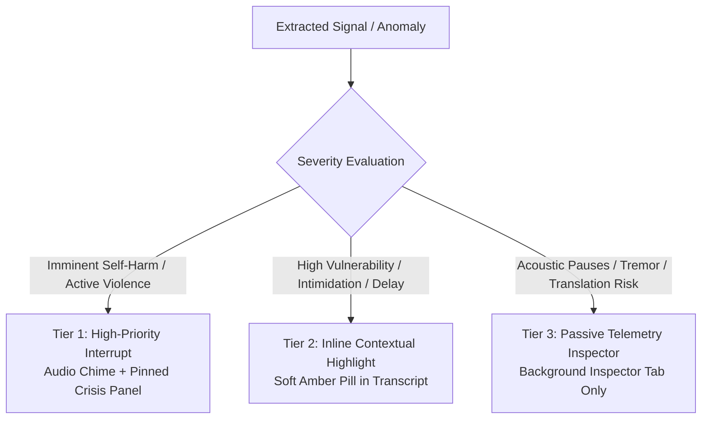
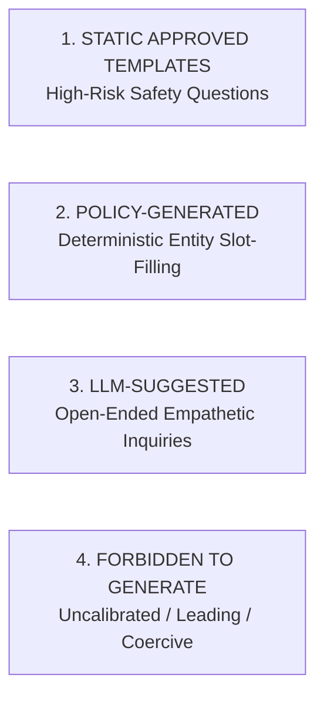

# SAMBAL AI Policy — Alert Priority Registry & Question Generation Governance

> **Packet ID:** PKT-02  
> **Status:** AUTHORITATIVE AI POLICY  
> **Last Updated:** 2026-10-03  
> **Traceability:** Operator Cognitive Load Minimization, Clinical Question Governance  

---

## 1. Alert Priority Architecture (Anti-Alert-Fatigue Policy)

When every anomaly is rendered as a flashing red banner, human operators experience severe cognitive saturation and quickly begin dismissing all warnings indiscriminately.

SAMBAL enforces a three-tier **Alert Priority Architecture**:

### Table of Alert Tiers

| Alert Tier | Visual Token | Audio Behavior | Trigger Criteria | Operator Workspace Behavior |
| :--- | :--- | :--- | :--- | :--- |
| **Tier 1: Immediate Attention** | Cardinal Red Banner (`#DC2626`) | Single non-repeating chime (440 Hz soft bell) | - Explicit present-tense self-harm - Active violence / armed siege - Severe untreated trauma injury - Severe safety uncertainty | Pinned Crisis Panel locks top of screen; halts standard form auto-advance; displays direct de-escalation actions. |
| **Tier 2: Prioritized Review** | Soft Amber Pill (`#D97706`) | Silent (No audio) | - Passive hopelessness - Active intimidation / coercion - Social boycott decree - Vulnerable dependents at risk | Highlights relevant text snippet inline; surfaces gentle suggested clarifying questions; does not interrupt typing. |
| **Tier 3: Supporting Telemetry** | Civic Slate Pill (`#475569`) | Silent (No audio) | - Vocal tremor / pitch variability - Weeping pauses (> 3.0s) - Translation dialect ambiguity - Routine administrative delay | Displayed passively in the Evidence Inspector sidebar tab; zero visual clutter in main intake view. |

---

## 2. Suggested Next Question Governance

To ensure helpline operators ask ethically sound, legally appropriate, and trauma-informed follow-up questions, the system enforces a strict four-category **Question Generation Policy**:

### Category 1: Static Approved Templates (Mandatory for High-Risk Scenarios)
- **Governance:** Authored by psychiatric and legal experts; clinically validated; translated and vetted across all supported Indic languages.
- **Rule:** When Immediate Safety reaches `CRITICAL_REVIEW` or `ELEVATED`, the system MUST present ONLY static approved templates. LLM dynamic generation is strictly locked out.
- **Canonical Approved Templates:**
  - *Safety Check:* *"Are you somewhere you feel safe to talk right now?"*
  - *Proximity Check:* *"Is the person who threatened you nearby or within sight?"*
  - *Immediate Harm Check:* *"Have you hurt yourself or taken anything to harm yourself today?"*
  - *Support Offer:* *"Would you like help connecting with a trained support professional right now?"*
  - *Safe Contact Channel:* *"Is it safe for our team to call you back on this number, or do you prefer text?"*

### Category 2: Policy-Generated Questions (Deterministic Slot-Filling)
- **Governance:** Generated by deterministic rules when statutory atrocity entities are missing from the complaint.
- **Examples:**
  - *"Did this incident take place in a public view or inside a private house?"* (Required for PoA Section 3(1)(r) statutory element).
  - *"Have you approached the local police station to register an FIR?"* (Required for PoA Rule 5 check).

### Category 3: LLM-Suggested Questions (Low-Risk Open Inquiries)
- **Governance:** Generated by local constrained LLMs adhering to strict system prompts.
- **Permitted Scope:** Broad, non-leading, empathetic clarification for low-urgency civil complaints.
- **Constraint:** Must always be framed neutrally and can never suggest legal conclusions or lead the witness.

### Category 4: Strictly Forbidden Questions (Zero-Tolerance Prompts)
The system is fundamentally prohibited from generating or suggesting:
1. **Victim-Blaming Questions:** (e.g. *"Why did you go to their locality?", "Why didn't you shout for help?"*).
2. **Leading Evidentiary Questions:** (e.g. *"Did they hit you with an iron rod to kill you?"*).
3. **Medical Diagnostic Questions:** (e.g. *"Do you suffer from clinical depression?"*).
4. **Coercive Compliance Questions:** (e.g. *"Why haven't you compromised with the village head?"*).
