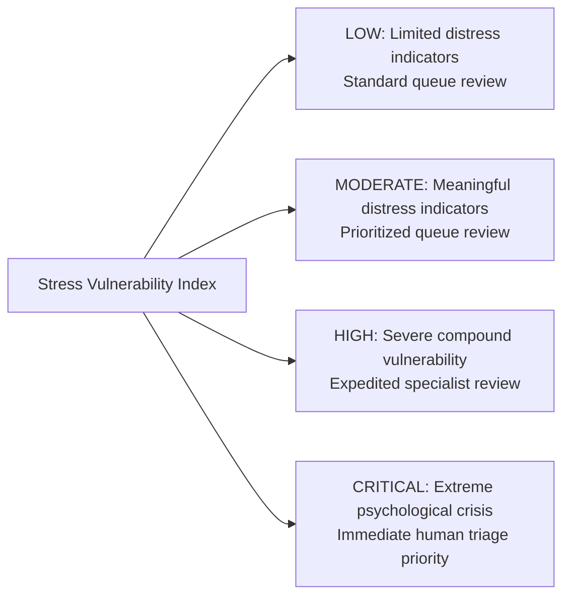

# SAMBAL AI Policy — Stress Vulnerability Index (SVI) Specification

> **Packet ID:** PKT-02  
> **Status:** AUTHORITATIVE AI POLICY  
> **Last Updated:** 2026-10-03  
> **Traceability:** SIH26093 SVI Triage Mandate, Responsible AI Framework  

---

## 1. Principle & Operational Meaning of SVI

The Stress Vulnerability Index (SVI) is an algorithmic triage construct designed to solve a single operational challenge in high-volume public helplines:
> **"How much vulnerability/distress-related concern is present in the available evidence to prioritize human review?"**

### 1.1 SVI Status in Packet 02
```text
┌─────────────────────────────────────────────────────────────────────────────┐
│ CURRENT STATUS:                   PROVISIONAL_TRIAGE_POLICY                 │
│                                                                             │
│ STRICT ARCHITECTURAL DOCTRINE:                                              │
│ - Packet 02 defines conceptual dimensions, safety rules, and bands.         │
│ - ZERO MATHEMATICAL WEIGHTS (e.g. 0.3*text + 0.2*voice) ARE ENCODED HERE.   │
│ - NO ARBITRARY LINEAR ARITHMETIC OR FAKE CLINICAL PRECISION.                │
│ - Empirical mathematical fusion and ROC/AUC tuning belong strictly to       │
│   PACKET 11 (Multimodal Fusion & SVI Scoring Engine).                       │
└─────────────────────────────────────────────────────────────────────────────┘
```

---

## 2. Conceptual SVI Triage Bands

SVI categorizes cases into 4 standardized operational bands defined by observable distress and vulnerability indicators:



### Band 1: `LOW`
- **Conceptual Definition:** The available narrative contains limited indicators of acute psychological vulnerability, trauma recall, or emotional breakdown. The complainant communicates with stable functional clarity regarding administrative, civil, or procedural matters.
- **Critical Guardrail:**
  > **`LOW` DOES NOT MEAN "NO TRAUMA", "NO NEED FOR HELP", OR "CASE UNIMPORTANT".**  
  > It simply indicates routine queue prioritization. The citizen's legal claims are treated with equal gravity.

### Band 2: `MODERATE`
- **Conceptual Definition:** Meaningful vulnerability indicators are present, such as persistent anxiety regarding community ostracization, emotional fatigue from repeated bureaucratic delays, or mild sleep/distress complaints.
- **Operational Action:** Expedited operator review; proactive recommendation of standard psychosocial counselling and legal advice.

### Band 3: `HIGH`
- **Conceptual Definition:** Multiple or severe vulnerability indicators are present: profound grief, acute panic, expressions of despair or helplessness, social isolation following a community boycott, or cumulative historical trauma.
- **Operational Action:** High-priority operator assignment; recommendation of specialized mental health support (Tele-MANAS) and active case tracking.

### Band 4: `CRITICAL`
- **Conceptual Definition:** Extreme psychological distress indicating an acute crisis: explicit or disguised suicidal ideation, total breakdown of personal coping mechanisms, severe physical trauma shock, or terror resulting from violent attacks.
- **Operational Action:** Immediate Tier-1 human triage interrupt; senior operator assignment; immediate crisis stabilization protocol.

---

## 3. Input Modalities & Evidence Fusion Principles

When mathematical fusion is implemented in Packet 11, it must adhere to the following **Qualitative Invariant Principles**:

1. **Non-Linear Interaction:** Vulnerability is non-linear. High linguistic despair combined with geographic isolation produces an exponential increase in vulnerability, which cannot be represented by simple additive addition.
2. **Asymmetric Safety Clamping:** If any modality identifies explicit imminent danger or suicidal crisis, the overall triage state is immediately clamped to **`CRITICAL`** regardless of other signals.
3. **Uncertainty Propagation:** When input quality degrades (e.g. low audio SNR or transcript ambiguity), SVI confidence must DECREASE. The system must never output high-confidence vulnerability scores on low-quality data.

---

## 4. What SVI Is NOT (Absolute Negative Boundaries)

To protect citizens from algorithmic prejudice and legal harm:
- SVI is **NOT a Psychiatric Diagnosis:** It never outputs DSM-5 or ICD-11 diagnostic classifications.
- SVI is **NOT a Credibility Metric:** High SVI does not prove the incident occurred; Low SVI does not imply fabrication.
- SVI is **NOT Evidence in Court:** Internal SVI triage calculations are strictly administrative work-management artifacts and possess zero evidentiary standing in criminal proceedings under the PoA Act.
- SVI is **NOT Displayed to Citizens:** Numerical SVI values are hidden from citizen screens to prevent panic, gaming, or feelings of algorithmic dehumanization.
