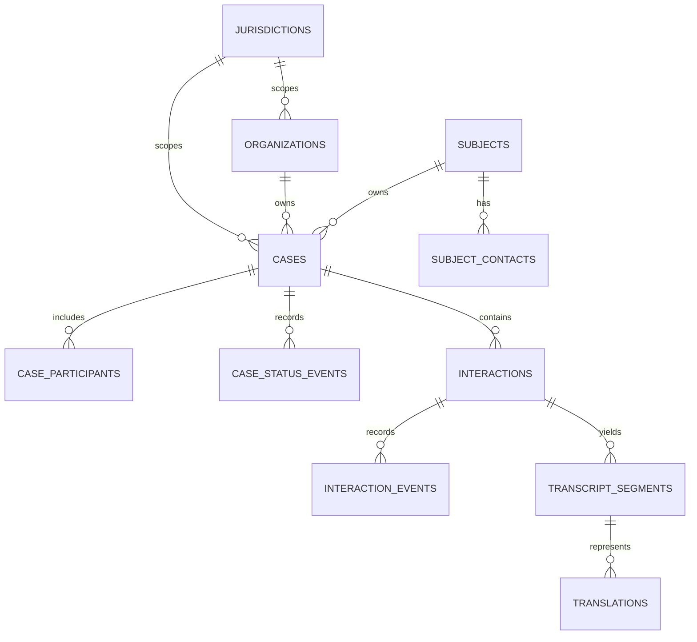
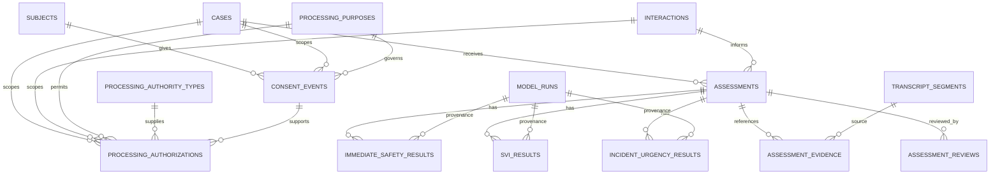
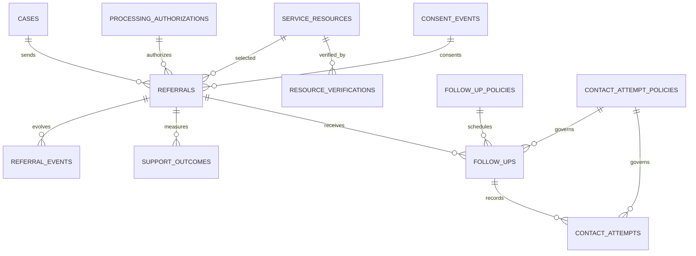
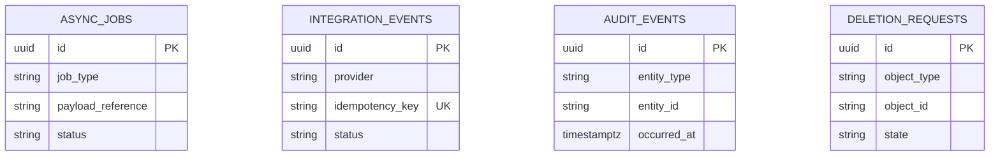

# Packet 03 Entity Relationship Diagrams

The diagrams are split by domain so the safety-critical relationships remain readable. All identifiers are UUIDs unless a field is explicitly a safe external/reference string.

## Governance and case source

## Privacy, intelligence, and provenance

## Support and operations

## Platform governance

