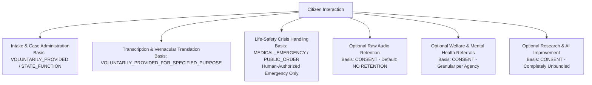

# SAMBAL Privacy Specification — Lawful Basis & Consent Model
## Architectural Baseline, Phased DPDP Readiness & Granular Governance

> **Packet ID:** PKT-02R  
> **Status:** AUTHORITATIVE SPECIFICATION  
> **Evaluation Date:** 2026-10-03  
> **Regulatory Architecture:** Privacy-by-Design Baseline / DPDP-Ready Phased Implementation  
> **Statutory Truth Context:** Phased commencement under Government of India Notification dated 13 November 2025. Key operational sections governing grounds for processing, notice, consent, data fiduciary obligations, and principal rights are subject to an 18-month commencement runway (May 2027). This document establishes the architectural baseline (`PRIVACY_BY_DESIGN_BASELINE` / `DPDP_READY`) in advance of full statutory enforcement.

---

## 1. Foundational Doctrine: Lawful Basis Distinct from Consent

Under Indian privacy jurisprudence and the phased framework of the Digital Personal Data Protection Act, 2023, **consent is one of multiple distinct lawful processing authorities**. Public welfare delivery, statutory grievance redressal under the PoA Act, and life-safety emergency interventions must not be conflated with commercial opt-in consent:

1. **Separation of Lawful Basis from Consent:**
   - Where the State processes grievance information pursuant to statutory mandates (e.g. PoA Act, Legal Services Authorities Act), the processing authority is `STATE_FUNCTION_UNDER_LAW` or `LEGAL_OBLIGATION`.
   - Where a citizen reaches out for assistance and voluntarily shares facts, the authority is `VOLUNTARILY_PROVIDED_FOR_SPECIFIED_PURPOSE`.
   - Where a life-threatening crisis occurs (unconscious caller, active armed violence), processing proceeds under `MEDICAL_EMERGENCY` or `PUBLIC_ORDER_OR_DISASTER_ASSISTANCE` with minimum disclosure and full human audit.
   - `CONSENT` is required for optional, secondary, or cross-agency sharing activities (e.g. voluntary counselling, research, raw audio storage).
2. **Emergency Processing Never Deadlocks on Consent:**
   - Normal support referrals require explicit citizen consent and preference.
   - For genuinely urgent situations, an emergency referral to ERSS 112 or medical services may proceed under an emergency lawful basis without deadlock.
   - **Zero AI Emergency Overrides:** Under no circumstance may an AI model create an `AI_OVERRIDE_CONSENT`. An emergency exception can only be authorized by an authenticated human operator or supervisor following documented emergency protocols.
3. **Service Delivery Is Never Conditional on Research:**
   - A citizen who declines secondary research or model improvement receives the exact same high-priority grievance handling, protection, and welfare support.
4. **Ephemeral Audio Streaming Doctrine:**
   - Raw audio is processed transiently in volatile memory and discarded immediately upon transcription. Storing raw audio is strictly optional, unbundled, and disabled by default.

---

## 2. Lawful Basis & Consent Matrix

The platform categorizes data processing across distinct dimensions:



### Table of Processing Authorities & Consent Specifications

| # | Processing Purpose | Lawful Basis (`LawfulBasis`) | Consent Requirement | Plain-Language Citizen Explanation | Revocability & Behavior | Effect of Refusal | Retention Authority & Scope | Authorized Recipients |
| :-: | :--- | :--- | :---: | :--- | :--- | :--- | :--- | :--- |
| **1** | **Speech Transcription** | `VOLUNTARILY_PROVIDED_FOR_SPECIFIED_PURPOSE` | Notice provided; required for audio channel | *"We convert your voice into text so our team can read and register your complaint accurately."* | Irrevocable after complaint finalized as an official administrative record. | Citizen may choose `[ WRITE ]` or `[ SILENT ]` text intake instead. | Case file baseline: active investigation + statutory appeal (`RETENTION_POLICY_PENDING`). | Assigned Operator, Supervisor, Case Officer. |
| **2** | **Ephemeral Audio Processing** | `CONSENT` (Optional supporting feature) | Optional explicit opt-in | *"Our system listens to sound cues during the call to help our operator understand your distress level."* | Volatile RAM only. Wiped immediately upon token generation. | System disables acoustic feature extraction; processes text only. | **Zero disk retention.** Volatile memory purged in < 30 seconds. | In-memory stream processor only; never persisted to disk. |
| **3** | **Raw Audio Retention** | `CONSENT` (Strict Opt-In) OR `LEGAL_OBLIGATION` | **Strictly Optional (Disabled by default)** | *"Do you permit us to retain the recording as part of the case record where authorized and relevant? (You can say No)."* | **Revocable prior to formal statutory preservation order.** Tracks multi-stage deletion states. | **Zero penalty.** Audio is not stored; case proceeds on text transcript alone. | `RETENTION_POLICY_PENDING` (Subject to departmental call recording schedule). | Secure encrypted object store; Investigating Officer only. |
| **4** | **AI-Assisted Assessment** | `STATE_FUNCTION_UNDER_LAW` | Notice provided; AI is non-diagnostic | *"We use an automated assistant to help highlight key facts for the human officer reviewing your case."* | Citizen cannot opt out of triage, but retains the right to manual officer review. | Case is processed via 100% manual operator review. | Linked to case lifecycle; archived with case file. | Assigned Operator and Supervisor only. |
| **5** | **Indic Translation** | `VOLUNTARILY_PROVIDED_FOR_SPECIFIED_PURPOSE` | Bundled with cross-language communication | *"If you need support from a central agency, we translate your summary into Hindi or English."* | Revocable prior to dispatch. | Referral is routed exclusively to local district officers fluent in the native tongue. | Tied to case dossier retention (`RETENTION_POLICY_PENDING`). | Assigned cross-regional service providers. |
| **6** | **Welfare & Health Referrals** | `CONSENT` (Except emergency life peril) | **Granular per agency** | *"Do you agree to share your contact details and this summary with a free legal aid lawyer / counsellor?"* | Revocable until referral is acknowledged and contact initiated. | Specific referral is aborted; alternative services offered. | Service partner retention policy (`RETENTION_POLICY_PENDING`). | Explicitly selected provider agency only (role-minimized). |
| **7** | **Emergency Life-Safety Handoff** | `MEDICAL_EMERGENCY` / `PUBLIC_ORDER_OR_DISASTER_ASSISTANCE` | Emergency Lawful Basis (Human-Authorized) | *"If you are in immediate physical danger, our team can alert emergency services to assist you."* | Cannot be retracted once dispatch is executed; cancellation requires formal police coordination. | If citizen refuses and is competent, refusal is respected unless active violent felony in progress. | State Emergency Response log (`RETENTION_POLICY_PENDING`). | State ERSS 112 Control Room / Police Desk. |
| **8** | **Research & Model Improvement** | `CONSENT` | **Strictly Unbundled Opt-In** | *"May we use an anonymized version of this conversation (with all names and addresses removed) to improve our system?"* | **Fully Revocable prior to irreversible anonymization.** Bounded 24-month retention schedule. | **ZERO EFFECT ON SERVICE DELIVERY.** Full assistance provided without difference. | Bounded 24-month review schedule; datasets retired or re-evaluated. Not indefinite. | Authorized AI safety researchers and evaluators. |

---

## 3. Truthful Legal Evidentiary Positioning for Audio

Citizen-facing language and administrative policies must **never** promise:
- *"Save this recording as legal evidence"*
- *"Guaranteed court admissibility"*
- *"Special Court direct access"*

Whether a digital voice recording is admissible as legal evidence is strictly governed by statutory procedural laws:
1. **Bharatiya Sakshya Adhiniyam, 2023 (BSA Section 63) / Indian Evidence Act (Section 65B):** Electronic records require formal certification by an authorized officer, proof of unbroken hash integrity (SHA-256), secure chain of custody, and judicial determination of relevance and authenticity.
2. **Authoritative Plain-Language Phrasing:** The platform shall state:
   > *"You may choose to retain the recording as part of the case record where authorized and relevant. Admissibility in any legal proceeding depends on statutory procedure and the competent court."*

---

## 4. Multi-Stage Deletion Tracking (No False Storage Guarantees)

Modern distributed object storage cannot truthfully guarantee instantaneous, zero-latency physical block purging across geographic replicas, write-ahead logs, and automated disaster-recovery snapshots.

SAMBAL replaces false purging claims with an authoritative **Multi-Stage Deletion Lifecycle** (`DeletionState`):

```text
[Citizen Revokes Consent / Retention Expires]
                    ↓
           DELETION_REQUESTED
                    ↓
        PRIMARY_OBJECT_DELETED (Live S3/MinIO bucket pointer expunged)
                    ↓
             RETENTION_HOLD? (Check for active court preservation order)
             ├── YES ──> RETENTION_HOLD (Preserved under legal order)
             └── NO
                    ↓
        BACKUP_EXPIRY_PENDING (Awaiting disaster recovery snapshot rotation)
                    ↓
           DELETION_VERIFIED (All cryptographic keys discarded; full purge certified)
```

---

## 5. Research Anonymization & Revocation Resolution

To resolve the contradiction between continuous revocability and anonymized training corpora:
1. **Pre-Anonymization Phase:** During this window, research consent is **fully revocable**. A citizen revocation request immediately purges the raw record from the research ingestion queue.
2. **Anonymization Event:** Records undergo irreversible cryptographic anonymization:
   - Direct identifiers (name, phone, address, Aadhaar) are scrubbed.
   - Indirect identifiers (locations, caste specifics, employer, relative names) are generalized or replaced with synthetic tokens.
   - Voice audio (if consented) is converted into non-invertible acoustic feature embeddings or synthetic voice replicas.
3. **Post-Anonymization Status:** Once the mathematical link to the individual is permanently severed, individual records cannot be identified, extracted, or selectively deleted. Notice explicitly informs the citizen of this technical boundary prior to consent.
4. **Bounded Retention Schedule:** Research datasets are **never stored indefinitely**. They are subject to a **24-month bounded lifecycle**, after which the dataset version is retired, archived in an offline air-gapped vault, or systematically re-evaluated.

---

## 6. Data-Minimized Consent Ledger

To prevent the consent ledger itself from becoming an invasive surveillance tool, SAMBAL stores only the **minimum necessary proof of compliance**:

```typescript
interface ConsentRecord {
  consent_id: string; // UUIDv4
  case_reference_id: string; // Pseudonymous case reference
  purpose_id: string; // e.g. "PURP-06"
  choice: "GRANTED" | "REFUSED" | "REVOKED";
  policy_version: string; // e.g. "2026.1-DPDP"
  timestamp: string; // ISO-8601 UTC
  channel: "WEB" | "IVR" | "OPERATOR_CONFIRMED";
  actor_id: string; // Citizen session token or authenticated Operator ID
}
```

*Prohibited from Default Consent Ledger:* IP addresses, device IMEI/MAC identifiers, telephony cell tower IDs, and browser fingerprinting hashes are **strictly prohibited** from the consent ledger. Network metadata is retained exclusively in segregated, time-bounded WAF/security logs under CERT-In statutory compliance rules (`PURP-17`).
