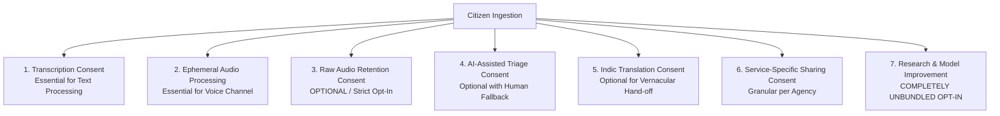

# SAMBAL Privacy Specification — Purpose-Specific Consent Model

> **Packet ID:** PKT-02  
> **Status:** AUTHORITATIVE SPECIFICATION  
> **Last Updated:** 2026-10-03  
> **Traceability:** Digital Personal Data Protection (DPDP) Act 2023, Section 6 Consent Architecture  

---

## 1. Foundational Doctrine: Unbundled & Granular Consent

Under the Digital Personal Data Protection Act, 2023 (DPDP Act) and international human rights standards, consent obtained through coercive bundling—where a citizen must surrender all privacy rights to receive emergency public assistance—is legally invalid and ethically indefensible.

SAMBAL enforces **Granular, Unbundled, and Freely Given Consent**:
1. **Service Delivery Is Never Conditional on Research:** A citizen who refuses to allow their data to be used for model training or research shall receive the exact same high-priority grievance processing, protection, and support as any other citizen.
2. **Raw Audio Retention Is Strictly Opt-In:** Raw audio is processed transiently in volatile memory and deleted immediately after transcription unless explicit, informed, unbundled consent is granted.
3. **Continuous Revocability:** Citizens have the right to withdraw consent for secondary sharing or storage at any time through their tracking token or by informing an operator.

---

## 2. Granular Consent Matrix

The platform manages 7 distinct, independent consent items:

### Table of Consent Specifications

| # | Consent Dimension | Purpose | Required or Optional? | Plain-Language Citizen Explanation | Revocability | Effect of Refusal | Retention Period | Authorized Recipients |
| :-: | :--- | :--- | :---: | :--- | :--- | :--- | :--- | :--- |
| **1** | **Speech Transcription** | Convert spoken voice into text for operator reading and record keeping. | **Required for Voice** (Optional if writing) | *"We convert your voice into text so our team can read and register your complaint accurately."* | Irrevocable after complaint finalized (statutory record). | Citizen may choose `[ WRITE ]` or `[ SILENT ]` text intake instead. | Retained as official grievance text under PoA Act rules. | Assigned Operator, Supervisor, Investigating Officer. |
| **2** | **Ephemeral Audio Processing** | In-memory acoustic feature analysis (pitch, tremor, pauses) during live call. | **Required for Voice Channel** | *"Our system listens to sound cues during the call to help our operator understand your distress level."* | Active during call; volatile memory wiped post-call. | System disables acoustic feature extraction; processes text only. | **Zero disk retention.** Volatile memory purged in < 30 seconds. | In-memory stream processor only; never persisted. |
| **3** | **Raw Audio Retention** | Storing the original voice audio recording in encrypted object storage. | **STRICTLY OPTIONAL (Opt-In Only)** | *"Do you permit us to save a voice recording of this call as legal evidence for your case? (You can say No)."* | **Fully Revocable** at any time via tracking portal. | **Zero penalty.** Audio is permanently purged; case proceeds on text transcript alone. | Definite statutory period (e.g. 90 days or trial duration) if consented. | Restricted to Special Court / Investigating Officer on subpoena. |
| **4** | **AI-Assisted Assessment** | Generating AI summaries, preliminary SVI bands, and recommended service matches. | **Optional** | *"We use an automated assistant to help highlight key facts for the human officer reviewing your case."* | Revocable before referral dispatch. | Case is processed via 100% manual operator form completion. | Tied to case lifecycle; archived with case file. | Assigned Operator and Supervisor only. |
| **5** | **Indic Translation** | Translating regional language transcripts to English or Hindi for inter-agency coordination. | **Optional** (Required for non-local agencies) | *"If you need support from a central agency, we translate your summary into Hindi/English."* | Revocable prior to dispatch. | Referral is routed exclusively to local district officers fluent in the native tongue. | Tied to grievance dossier retention. | Assigned cross-regional service providers. |
| **6** | **Inter-Agency Referral Sharing** | Transmitting minimized case dossiers to specific external support agencies (NALSA, Tele-MANAS). | **Granular & Optional per Service** | *"Do you agree to share your contact details and this summary with a free legal aid lawyer / counsellor?"* | Revocable until referral is acknowledged by provider. | Specific referral is aborted; alternative services offered. | Subject to provider's professional statutory retention rules. | Explicitly selected provider agency only (role-minimized). |
| **7** | **Research & Model Improvement** | Using anonymized transcripts to evaluate model fairness and improve Indic language AI. | **STRICTLY OPTIONAL & UNBUNDLED** | *"May we use an anonymized version of this conversation (with all names and addresses removed) to improve our system?"* | **Fully Revocable** at any time. | **ZERO EFFECT ON SERVICE DELIVERY.** Full assistance provided without difference. | Stored indefinitely in anonymized benchmark corpus. | Authorized AI safety researchers and evaluators. |

---

## 3. Consent Management Lifecycle & Revocation Protocol

1. **Digital Cryptographic Consent Token:** Every consent election is timestamped, cryptographically hashed, and stored in the `consent_ledger` table with citizen tracking ID, policy version, and IP/telephony trunk metadata.
2. **One-Click Citizen Revocation:** If a citizen accesses the portal with their tracking token and selects *"Revoke Data Sharing"*:
   - Outbound referral webhooks immediately send a `REVOCATION_NOTICE` to external providers.
   - External partner API credentials for that case dossier are invalidated.
   - Any optional stored raw audio is permanently expunged from MinIO S3 object storage with an immutable audit log.
