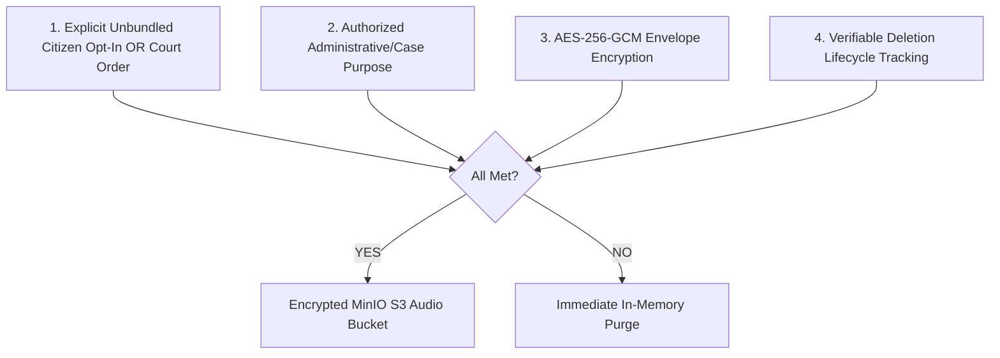

# SAMBAL Privacy Specification — Data Minimization & Ephemeral Audio Policy
## Proportional Necessity, Field-Level Restrictions & Ephemeral Voice Doctrine

> **Packet ID:** PKT-02R  
> **Status:** AUTHORITATIVE SPECIFICATION  
> **Evaluation Date:** 2026-10-03  
> **Regulatory Architecture:** Privacy-by-Design Baseline / DPDP-Ready Phased Implementation  
> **Statutory Truth Context:** Phased commencement under Government of India Notification dated 13 November 2025. Data minimization and purpose limitation are treated as core architectural baselines (`PRIVACY_BY_DESIGN_BASELINE`), in advance of the full 18-month statutory enforcement date (May 2027).

---

## 1. Principle of Strict Data Minimization

The collection of personal data in high-stakes public safety systems must follow the principle of **Proportional Necessity**:
> **No data field shall be collected, requested, or stored merely because "it might be useful later."**  
> Every single field in the data architecture must have an explicit statutory, operational, or life-safety justification.

---

## 2. Workflow-Specific Data Minimization Registry

| Workflow / Surface | Minimum Data Required | Permitted Optional Data | Strictly Prohibited / Unnecessary Data | Sharing Scope | Retention Boundary |
| :--- | :--- | :--- | :--- | :--- | :--- |
| **Initial Citizen Ingestion (PWA/IVR)** | Spoken or typed grievance statement; preferred language; basic incident location (district). | Contact phone number (optional if anonymous tracking selected); safe callback time. | National identity numbers (Aadhaar), biometric data, bank details, caste certificate numbers. | Ingestion layer only (never public). | Purged from browser storage upon submission or Quick Exit navigation. |
| **Silent Distress Intake** | Tapped emergency answers (safe/unsafe, immediate help needed); approximate location. | Silent SMS number. | Detailed written narrative; background voice audio; browser device fingerprints. | Operator Triage Queue only. | In-memory session purged; dossier minimized. |
| **Helpline Operator Triage** | Validated transcript; incident date & location; identified needs; immediate safety flag. | Caller name (if voluntarily disclosed); specific landmark. | Full family ancestry, income tax details, unrelated civil litigation history. | Internal Triage Hub (Operator + Supervisor). | Case file baseline: active investigation + statutory appeal (`RETENTION_POLICY_PENDING`). |
| **Legal Aid Referral (NALSA)** | Date, time, village of incident; nature of offence; accused names; police FIR status. | Complainant phone number (for advocate consultation); witness names. | Medical therapy notes, psychological distress scores, raw acoustic telemetry. | Assigned DLSA / TLSC Panel Advocate. | Governed by Legal Services Authorities Act record rules (`RETENTION_POLICY_PENDING`). |
| **Mental Health Referral (Tele-MANAS)** | Preferred language; psychosocial distress summary; safe contact number; immediate safety state. | Complainant first name; preferred callback window. | Full legal dispute filings, property documents, accused criminal records. | Assigned Tele-MANAS Cell Counsellor. | Governed by health data standards (`RETENTION_POLICY_PENDING`). |
| **Emergency Rescue (ERSS 112)** | Immediate physical danger description; precise current location / address; phone number. | Number of trapped individuals. | Historical complaints; detailed legal claims; mental health session logs. | ERSS 112 Control Room Dispatcher. | Governed by State Police emergency dispatch log rules (`RETENTION_POLICY_PENDING`). |

---

## 3. Authoritative Raw Audio Policy

Voice recordings of citizens reporting atrocities contain extreme emotional vulnerability, ambient background sounds, intimate conversations, and sensitive identifying details. Persisting raw audio on disk creates a severe data breach, surveillance, and re-traumatization liability.

### 3.1 The Default Architecture: Ephemeral Streaming Processing
```text
┌─────────────────────────────────────────────────────────────────────────────┐
│ DEFAULT OPERATIONAL DOCTRINE:                                               │
│                                                                             │
│                  PROCESS TRANSIENTLY IN VOLATILE MEMORY                     │
│                                                                             │
│                       DO NOT RETAIN BY DEFAULT                              │
└─────────────────────────────────────────────────────────────────────────────┘
```

1. **In-Memory Buffering:** Audio streams are received as discrete chunks (PCM / WAV) in volatile memory buffers strictly for the duration of real-time ASR transcription and acoustic feature extraction.
2. **Immediate Volatile Deletion:** Once a transcription segment is finalized by the ASR engine, the corresponding raw audio chunk is expunged from memory.
3. **Zero Default Disk Persistence:** Neither the web server, nor the backend API, nor the MinIO object storage writes raw audio files to disk by default.

---

### 3.2 Conditions for Authorized Raw Audio Retention

Raw audio retention is permitted **only** when the following conditions are simultaneously satisfied:



1. **Condition 1: Lawful Authority / Explicit Consent:** The complainant has explicitly toggled the separate raw audio retention consent option, OR a formal judicial preservation order has been served.
2. **Condition 2: Authorized Case Purpose:** Retained as part of the official case record where authorized and relevant. The system **never** claims guaranteed court admissibility or automated legal evidence status.
3. **Condition 3: End-to-End Cryptographic Protection:**
   - Audio is encrypted before writing to MinIO using **AES-256-GCM** with a per-recording Data Encryption Key (DEK).
   - Encryption keys are stored in a dedicated Key Management Service (KMS) with restricted role-based decryption.
4. **Condition 4: Verifiable Multi-Stage Deletion Lifecycle:**
   - Rather than making unverified claims of "instant physical block erasure across all storage media," the system tracks deletion progress through explicit states:
     `DELETION_REQUESTED` → `PRIMARY_OBJECT_DELETED` → `RETENTION_HOLD` (if active preservation order) → `BACKUP_EXPIRY_PENDING` → `DELETION_VERIFIED`.
   - *Authoritative Retention Duration:* The platform does **not** fabricate arbitrary retention periods. Duration is governed by:
     - Departmental call recording schedules (`RETENTION_POLICY_PENDING`).
     - Specific judicial preservation orders issued by a competent Special Court.
     - Unrequisitioned recordings are deleted upon closure of administrative review.
