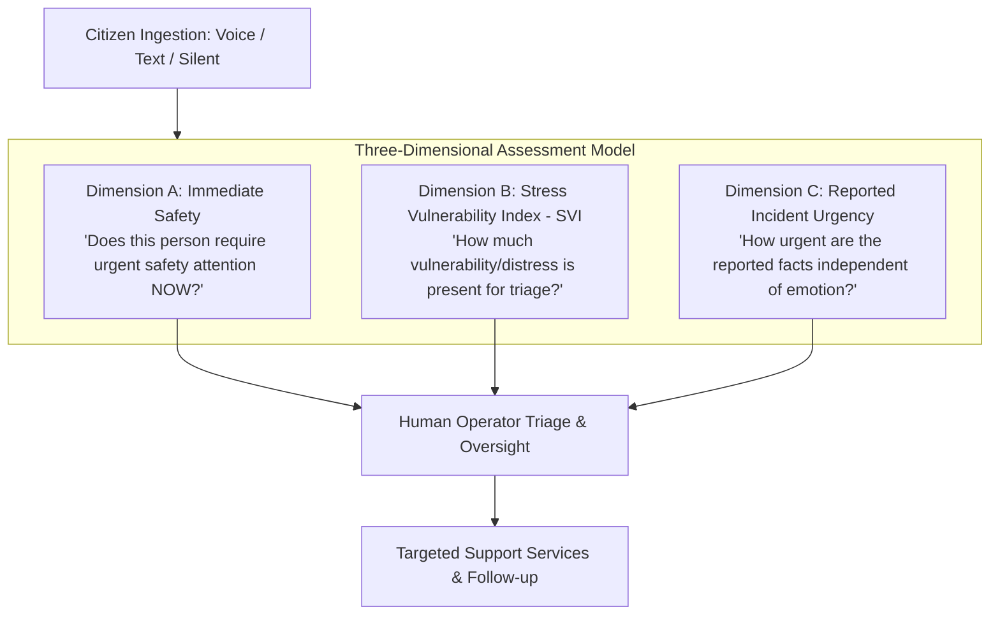

# SAMBAL Product Specification — Three-Dimensional Assessment Model

> **Packet ID:** PKT-02  
> **Status:** AUTHORITATIVE SPECIFICATION  
> **Last Updated:** 2026-10-03  
> **Core Mandate:** Strict separation of Immediate Safety, SVI, and Reported Incident Urgency  

---

## 1. Executive Summary & Core Principle

Traditional emergency and grievance systems conflate an individual's emotional distress with the objective severity of their situation. This creates catastrophic failure modes:
1. **The Dangerous False Negative:** A victim speaking in a quiet, monotonic, or calm voice due to shock, dissociation, or proximity to perpetrators is deprioritized, even though they face active death threats.
2. **The Inappropriate False Positive:** A highly agitated caller crying or shouting over a resolved historical event is mistakenly routed to armed emergency police dispatch, escalating tensions unnecessarily.
3. **The Prejudicial Diagnosis Trap:** A machine learning system stamps a victim with clinical labels ("PTSD detected", "Depression confirmed") or legal verdicts ("Perpetrator guilty", "Caste atrocity verified"), exceeding both scientific validity and statutory authority.

SAMBAL solves this through an uncompromised **Three-Dimensional Assessment Model** where three questions are evaluated independently and in parallel:



---

## 2. Dimension A: Immediate Safety

### 2.1 The Core Question
> **"Is there evidence suggesting the person may require urgent safety-oriented human attention now?"**

### 2.2 Operational Scope & Boundary
Immediate Safety focuses exclusively on acute, real-time life and physical safety risks. It answers whether the caller/user is in immediate peril at this exact moment.

**Positive Evidence Examples:**
- Explicit, present-tense suicidal intent or active self-harm in progress.
- Ongoing violence or physical assault taking place during the communication.
- Armed or threatening perpetrators actively outside or approaching the victim's location.
- Communication itself is hazardous (e.g. caller whispering because an abuser is in the same room).
- Acute, life-threatening medical emergencies (e.g., severe bleeding, poisoning, burns).
- Direct citizen report of imminent mortal danger.

**Explicit Non-Scope:**
- **NOT A DIAGNOSIS:** Immediate Safety is never a psychiatric assessment or mental disorder classification.
- **NOT A CREDIBILITY JUDGMENT:** Elevated safety status does not imply the caller's claims are legally proven. It indicates an immediate protective human check is required.
- **NOT AUTOMATED POLICE DISPATCH:** High immediate safety signals NEVER automatically trigger external 112 dispatch without human operator review and supervisor authorization.

---

## 3. Dimension B: Stress Vulnerability Index (SVI)

### 3.1 The Core Question
> **"Based on the available evidence, how much vulnerability/distress-related concern is present for triage purposes?"**

### 3.2 Operational Scope & Boundary
SVI evaluates the overall burden of trauma, psychological strain, cumulative victimization, social isolation, and institutional marginalization to ensure vulnerable individuals are not lost in administrative queues.

**Status in Packet 02:**
```text
PROVISIONAL_TRIAGE_POLICY
```
*Strict Doctrine:* Packet 02 establishes the conceptual meaning and bands of SVI. **No mathematical weighting formula (e.g., 0.3 * text + 0.2 * audio), no linear arithmetic, and no final numerical cutoffs are permitted in Packet 02.** Mathematical fusion and empirical threshold calibration are strictly reserved for **Packet 11 (Multimodal Fusion & SVI Scoring Engine)** following scientific evaluation.

**SVI Conceptual Bands:**
- **`LOW`:** Available evidence contains limited vulnerability/distress indicators.
  *Critical Guardrail:* `LOW` does NOT mean "no trauma", "no need for help", or "case unimportant". It simply indicates routine queue priority.
- **`MODERATE`:** Meaningful indicators suggest specialized support (counselling, legal advice) or prioritized operator review will be valuable.
- **`HIGH`:** Multiple or severe distress indicators (e.g. panic symptoms, hopelessness, acute grief, severe systemic harassment) warrant prioritized human review.
- **`CRITICAL`:** Evidence indicates profound psychological vulnerability, total breakdown of support systems, or compound trauma requiring the highest human triage priority.

**Explicit Non-Scope:**
- SVI is NOT a clinical diagnosis of PTSD, depression, or anxiety.
- SVI is NOT a measure of complainant honesty or legal merit.
- SVI does NOT alter the legal classification of an atrocity under the PoA Act.

---

## 4. Dimension C: Reported Incident Urgency

### 4.1 The Core Question
> **"How urgently should the reported circumstances receive authorized human review based on the facts reported?"**

### 4.2 Operational Scope & Boundary
Reported Incident Urgency examines the objective, factual parameters of the incident described, completely decoupled from the emotional state, voice tone, or eloquence of the narrator.

**Evaluation Factors:**
- **Temporal Proximity:** Did the incident happen right now, 2 hours ago, yesterday, or 6 months ago?
- **Perpetrator Proximity & Ongoing Access:** Do the perpetrators reside in the same village? Are they actively issuing threats? Do they hold local power?
- **Physical Harm & Property Destruction:** Was there arson, physical battery, sexual assault, land grabbing, social boycott, or water source contamination?
- **Vulnerable Dependents at Risk:** Are children, elderly individuals, or pregnant women directly threatened?
- **Statutory Deadlines:** Impending court hearings, bail hearings for accused persons, or statutory 7-day relief disbursement requirements under PoA Rule 12(4).

**Incident Urgency Levels:**
- **`ROUTINE`:** Historical, non-imminent complaints; administrative delay queries; long-standing disputes without active threats.
- **`PRIORITY`:** Recent incidents with moderate risk of recurrence, property damage without ongoing violence, or institutional denial of services.
- **`URGENT`:** Atrocities occurring within 24–48 hours, active intimidation to withdraw an FIR, social boycotts, or denied medical care.
- **`CRITICAL`:** Imminent or ongoing violence, arson of homes, active siege of an SC/ST locality, or imminent death threats by armed perpetrators.

**Explicit Prohibitions on System Authority:**
The system MUST NEVER determine or infer:
1. Legal guilt or innocence of any named individual.
2. The veracity or truthfulness of the complainant.
3. Whether an offence is legally proven beyond reasonable doubt.
4. Whether provisions of the SC/ST (PoA) Act definitively apply in law (statutory determination is the exclusive province of the Special Court and Investigating Officer).

---

## 5. Assessment Authority Hierarchy & Evidence Precedence Rules

To prevent algorithmic hallucinations, emotion-AI distortions, or contradictory model outputs from misguiding operators, SAMBAL enforces a strict **Qualitative Evidence Precedence Hierarchy**:

```text
▲  HIGHEST PRECEDENCE
│
├── 1. Explicit Current Self-Report / Direct Safety Fact
│      ("They are breaking down my door right now", "I have taken poison")
│
├── 2. Human-Confirmed Case Information & Verified Historical Records
│      (Previous FIR registered, known witness protection status, verified district reports)
│
├── 3. Narrative Semantic Evidence (NLP / Grounded Text)
│      (Entities, timeline, reported threats, nature of atrocity, family status)
│
├── 4. Contextual Vulnerability Evidence
│      (Remote geographic isolation, midnight call timing, silent tap mode, single-parent status)
│
└── 5. Acoustic / Affective Supporting Signals
       (Voice tremor, pitch variability, prolonged pauses, high energy arousal)
│
▼  LOWEST PRECEDENCE (SUPPORTING EVIDENCE ONLY)
```

### Mandatory Guardrail Principles

#### Guardrail 1: Explicit Danger Cannot Be Cancelled by Calm Speech
If a citizen reports:
> *"I am speaking quietly from under the bed because the village head's men have surrounded my house with weapons."*

Even if the acoustic speech engine detects:
- Flat pitch contour
- Low energy arousal
- Low vocal jitter
- "Calm" affective signal

**The Rule:** The explicit semantic safety fact overrides the acoustic signal completely. Immediate Safety MUST be classified as **`CRITICAL_REVIEW`** or **`ELEVATED`**, and Incident Urgency as **`CRITICAL`**. Acoustic calm must NEVER downgrade an explicit threat report.

#### Guardrail 2: Strong Emotion Cannot Create a Legal Emergency by Itself
If a citizen calls weeping uncontrollably, with a shaking voice and high emotional pitch, describing an event that occurred 10 years ago where the court case has concluded and they are currently in a secure home:
- SVI will be elevated (**`HIGH`** or **`CRITICAL`**) because the individual is experiencing profound emotional distress and requires empathetic psychological counselling.
- Reported Incident Urgency remains **`ROUTINE`** or **`PRIORITY`** because there is no ongoing physical threat.
- Immediate Safety remains **`NO_IMMEDIATE_SIGNAL`** (unless explicit current self-harm is expressed).

**The Rule:** High emotional arousal must never automatically dispatch emergency police or trigger armed intervention.

#### Guardrail 3: Absence of Emotion Is Never Proof of Safety
Shock, trauma dissociation, neurodivergence, military/police background, or cultural stoicism frequently result in completely flat, unemotional affect during extreme crisis. The absence of emotional markers in voice or text must NEVER be interpreted as safety.

#### Guardrail 4: Acoustic / Affective AI Is Strictly Supporting Evidence
Acoustic and affective signals (speech rate, pitch variation, tremor, pauses) are designated as `SUPPORTING_SIGNAL_ONLY`. They serve solely to alert the operator to subtle distress cues that might warrant gentle pacing or trauma-sensitive phrasing. They have zero authority to mandate referrals or determine legal urgency.

---

## 6. Orthogonal Scenario Golden Matrix

The power of the Three-Dimensional Assessment Model is demonstrated by examining contrasting edge cases:

| Scenario Description | Dimension A: Immediate Safety | Dimension B: Stress Vulnerability Index (SVI) | Dimension C: Reported Incident Urgency | Resulting Action & Workflow |
| :--- | :--- | :--- | :--- | :--- |
| **Case 1: Calm Caller, Active Death Threat**<br/>Monotonic voice; reporting armed men outside their house right now. | **`CRITICAL_REVIEW`** (Explicit imminent threat) | **`MODERATE`** (Restrained verbal affect) | **`CRITICAL`** (Active physical siege) | Immediate Tier-1 operator alert; supervisor-authorized emergency protection review; de-escalation protocol. |
| **Case 2: Distressed Caller, Historical Event**<br/>Severe sobbing, shaking voice, hyperventilating; recounting an atrocity from 3 years ago; currently safe at home. | **`NO_IMMEDIATE_SIGNAL`** (No active threat) | **`HIGH`** (Acute distress presentation) | **`ROUTINE`** (No ongoing incident) | Compassionate trauma-informed pacing; prioritized Tele-MANAS / psychological counselling referral; zero police dispatch. |
| **Case 3: Urgent Administrative Denial**<br/>Firm, composed, steady voice; government hospital refused treatment to an atrocity victim with a broken arm. | **`REVIEW_RECOMMENDED`** (Untreated injury) | **`MODERATE`** (High resilience, severe barrier) | **`URGENT`** (Active medical denial within 24h) | Rapid medical intervention referral to District Civil Surgeon; legal aid notification under PoA Rule 12. |
| **Case 4: Silent Tap, Unknown Threat**<br/>User tapping silent intake buttons at 1:30 AM; reports "Someone watching outside"; cannot speak. | **`ELEVATED`** (Silent mode + night timing + unknown proximity) | **`MODERATE`** (Restricted info) | **`PRIORITY`** (Unclear facts pending check) | Immediate silent messaging channel; operator presents discreet tap questions; quick exit option primed. |
| **Case 5: Despair / Hopelessness**<br/>Low, tired voice; "No one helps our community, what is the point of living, I should end this." | **`CRITICAL_REVIEW`** (Explicit suicidal ideation) | **`CRITICAL`** (Complete despair & isolation) | **`PRIORITY`** (Grievance context secondary to life) | Crisis de-escalation protocol; warm transfer to Tele-MANAS crisis line; continuous operator engagement. |
