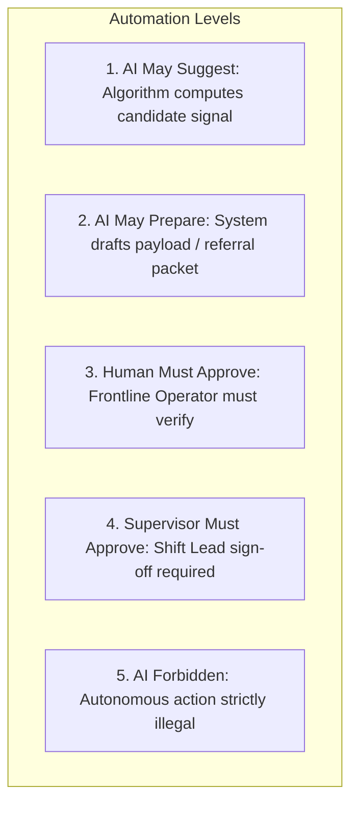
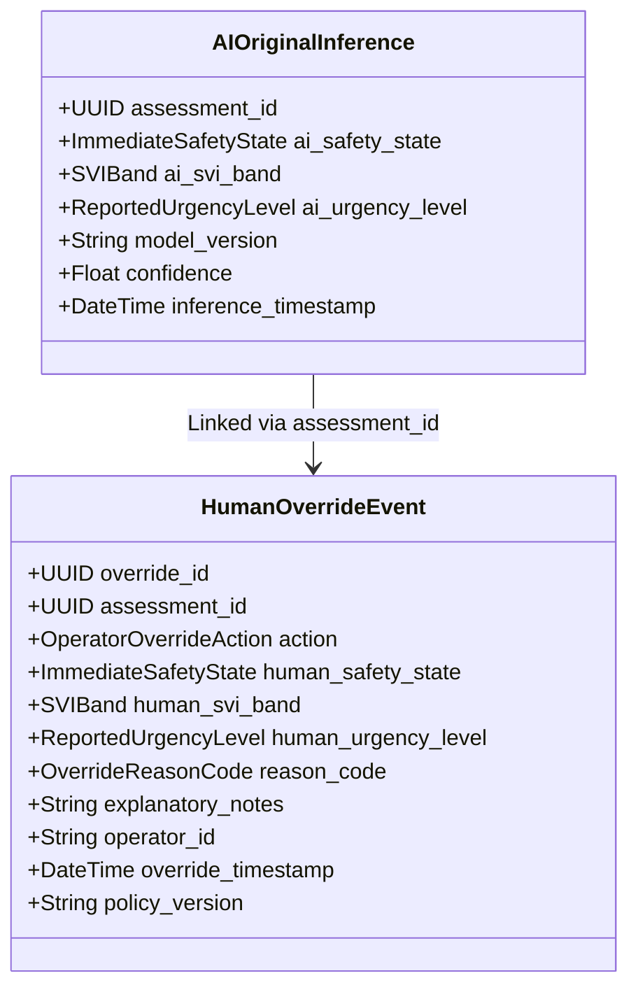

# SAMBAL Product Policy — Human Oversight & Decision Governance

> **Packet ID:** PKT-02  
> **Status:** AUTHORITATIVE POLICY  
> **Last Updated:** 2026-10-03  
> **Core Mandate:** Consequential Action Authority Matrix & Operator Override Model  

---

## 1. Governance Principle: Meaningful Human Control

In high-stakes public safety and atrocity grievance systems, automated decision-making without rigorous human oversight creates severe risks of constitutional rights violations, physical endangerment, and systemic discrimination.

SAMBAL strictly adheres to the principle of **Meaningful Human Control**:
1. **AI as an Assistant, Not an Authority:** Machine learning models process unstructured speech, audio, and text to surface signals, summarize context, and suggest actions. AI never holds executive or legal authority.
2. **Mandatory Human Sign-off:** No referral can be dispatched, no emergency agency alerted, no citizen record shared, and no case closed without an explicit, authenticated human action.
3. **Non-Destructive Overrides:** When an operator modifies or dismisses an AI suggestion, the system preserves the original AI output alongside the human decision, rationale, and timestamp for auditing.

---

## 2. Consequential Action Authority Matrix

The following matrix formally defines the boundaries of automation for every consequential action in the platform:

| Consequential Action | AI May Suggest? | AI May Prepare Payload? | Frontline Operator Approval Required? | Supervisor Approval Required? | AI Autonomous Execution Forbidden? | Legal / Policy Reference |
| :--- | :---: | :---: | :---: | :---: | :---: | :--- |
| **SVI Triage Band Assignment** | **YES** | **YES** | **YES** (Can accept/modify) | NO (Review in audits) | **FORBIDDEN** | DPDP Act Sec 9, FAIR AI Policy |
| **Safety Alert Display** | **YES** (Flags candidate) | **YES** (Presents snippet) | NO (Alert renders immediately) | NO | Allowed to display alert | Triage Latency Minimization |
| **Support Service Recommendation** | **YES** (Matches need) | **YES** (Pre-selects agency) | **YES** (Operator decides) | NO | **FORBIDDEN** | Citizen Consent Principle |
| **Counselling / Mental Health Referral** | **YES** (Recommends) | **YES** (Drafts summary) | **YES** (Consent verified) | NO | **FORBIDDEN** | Tele-MANAS Protocol 2024 |
| **Legal Aid (NALSA) Referral** | **YES** (Recommends) | **YES** (Extracts facts) | **YES** (Consent verified) | NO | **FORBIDDEN** | Legal Services Auth Act Sec 12 |
| **Medical Assistance Referral** | **YES** (Flags injury) | **YES** (Pre-fills hospital) | **YES** (Urgent verify) | NO | **FORBIDDEN** | Medico-Legal Care Standards |
| **Emergency / ERSS 112 Handoff** | **YES** (Flags imminent danger) | **YES** (Drafts location & threat) | **YES** (Confirms threat) | **YES** (Mandatory Sign-off) | **STRICTLY FORBIDDEN** | CrPC / BNSS, Life Safety Doctrine |
| **Witness Protection Review Request** | **YES** (Flags intimidation) | **YES** (Drafts threat facts) | **YES** (Reviews facts) | **YES** (Mandatory Sign-off) | **STRICTLY FORBIDDEN** | Witness Protection Scheme 2018 |
| **External Inter-Agency Data Sharing** | NO | **YES** (Applies minimization) | **YES** (Verifies consent) | **YES** (For non-standard targets) | **STRICTLY FORBIDDEN** | DPDP Act 2023 Sec 6 |
| **Formal Atrocity Case Closure** | NO | NO | **YES** (Must certify support delivered) | **YES** (For High/Critical cases) | **STRICTLY FORBIDDEN** | PoA Rules 1995 Rule 12 |

---

## 3. Operator Override Model

Helpline operators possess direct contextual awareness, emotional empathy, and cultural understanding that algorithmic models cannot replicate. Operators have full authority to override any AI assessment or recommendation.

### 3.1 Supported Override Actions

The platform supports 8 standardized override actions:

1. **`ACCEPT`:** Operator confirms the AI signal or recommendation as accurate and proceeds with workflow.
2. **`MODIFY`:** Operator adjusts the assessment (e.g. adjusts SVI from `HIGH` to `MODERATE`, or changes recommended service from `LEGAL_AID` to `COUNSELLING`).
3. **`DISMISS`:** Operator rejects an AI-generated safety alert or distress signal as a false positive (e.g. sarcastic remark or historical recollection).
4. **`ESCALATE`:** Operator escalates a case directly to supervisory review, even if AI classified it as low urgency.
5. **`REQUEST_SUPERVISOR`:** Operator requests real-time co-listening or supervisory assistance on an active call.
6. **`CORRECT_TRANSCRIPT`:** Operator directly corrects misrecognized words, names, or phrases in the live ASR transcript.
7. **`CORRECT_FACT`:** Operator corrects structured entity extraction (e.g. corrected incident date, village name, or number of accused).
8. **`FLAG_AI_ERROR`:** Operator submits the interaction to the model evaluation benchmark as a training defect (e.g. dialect misunderstanding, hallucination).

---

### 3.2 Non-Destructive Override Logging & Audit Schema

When an override occurs, the original model prediction is NEVER overwritten or expunged from the database. Both versions remain permanently linked:

### 3.3 Mandatory Reason Codes for High-Impact Overrides

For high-impact overrides (downgrading Immediate Safety from `CRITICAL_REVIEW`, changing SVI by 2+ bands, or dismissing an ERSS handoff alert), the operator must select a structured reason code and provide a brief explanatory note:

| Reason Code | Name | Applicable Scenarios |
| :--- | :--- | :--- |
| `OR_HISTORICAL_EVENT` | Historical / Past Incident | Caller was describing an old event; no present danger exists. |
| `OR_QUOTED_SPEECH` | Quoted or Reported Speech | Lethal words were quotes of an accused person or third party, not caller self-harm. |
| `OR_DIALECT_MISMATCH` | Dialect / Linguistic Idiom | ASR or NLP misinterpreted a regional idiom or cultural expression. |
| `OR_SARCASM_METAPHOR` | Sarcastic or Metaphorical Language | Caller used figurative speech (e.g. "I worked myself to death"). |
| `OR_SAFE_ENVIRONMENT` | Confirmed Safe Environment | Caller explicitly verified they are currently in a secure location. |
| `OR_CALLER_PREFERENCE` | Express Caller Preference | Complainant explicitly refused police or legal intervention; requested counselling only. |
| `OR_ASR_HALLUCINATION` | Speech Recognition Hallucination | Model generated repetitive or phantom words from background static. |
| `OR_NEW_FACTS_ELICITED` | Additional Facts Elicited | Direct conversation revealed facts not present in initial transcript. |

---

## 4. Supervisory Escalation & Review Triggers

Certain operational triggers automatically lock the intake docket until a shift supervisor reviews and signs off:

1. **Trigger A: Critical Safety Flag.** Any case where Immediate Safety reaches `CRITICAL_REVIEW`.
2. **Trigger B: Emergency Dispatch Request.** Any recommendation to hand off a case to ERSS 112 or police authorities.
3. **Trigger C: Model-Operator Conflict.** When an operator downgrades an AI-flagged `CRITICAL_REVIEW` to `NO_IMMEDIATE_SIGNAL`.
4. **Trigger D: Long Unreviewed Queue Age.** Any `URGENT` or `CRITICAL` case remaining unreviewed in the queue for > 15 minutes.
5. **Trigger E: Recurring Vulnerability.** A complainant who has contacted the helpline 3+ times within 7 days without verified service delivery.

---

## 5. Preventing Alert Fatigue (Three-Tier Alert Architecture)

To ensure operators do not become desensitized to red flashing banners, SAMBAL enforces strict alert tiering:

- **Tier 1 (Immediate Interrupt):** Reserved exclusively for active violence, present-tense suicide ideation, or imminent physical siege. (Average expected rate: < 3% of calls). Emits a single soft audio chime and pins the Emergency Action Panel.
- **Tier 2 (Inline Contextual Pill):** Rendered as soft amber indicators within the text transcript for passive hopelessness, recent threats, or legal deadlines. Does not interrupt workflow.
- **Tier 3 (Supporting Intelligence):** Displayed in the background Evidence Inspector tab for acoustic pauses, pitch jitter, and affective distress indicators. Purely passive reference.
