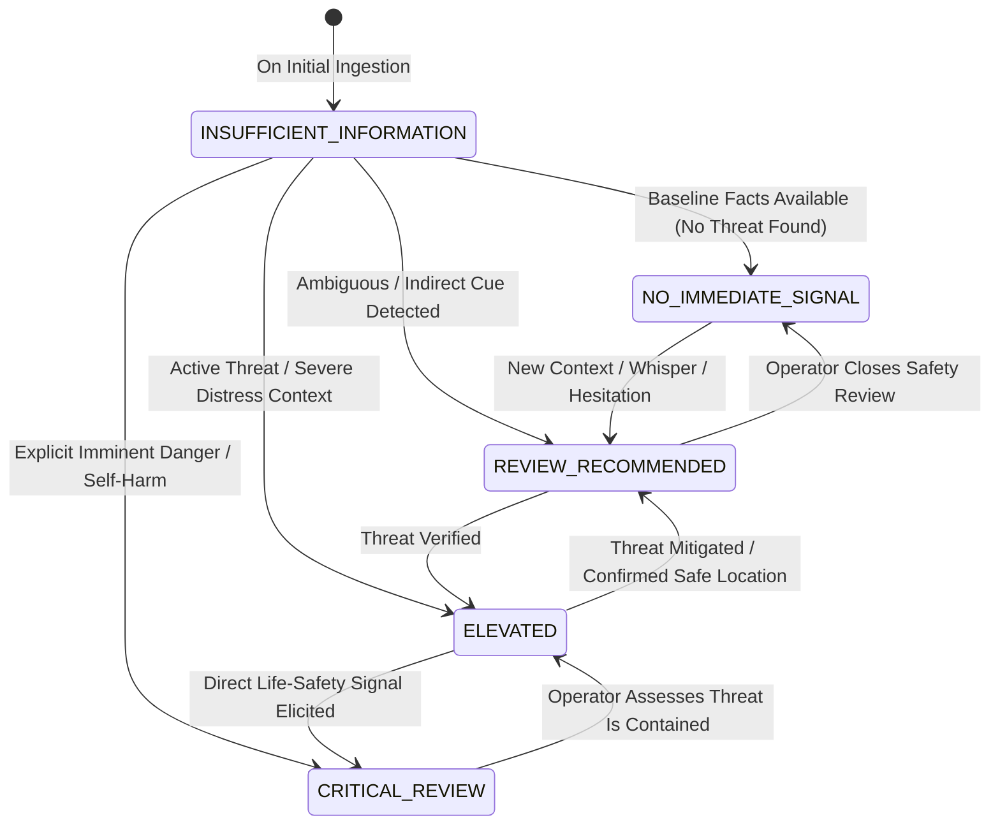

# SAMBAL Product Policy — Immediate Safety State Semantics

> **Packet ID:** PKT-02  
> **Status:** AUTHORITATIVE POLICY  
> **Last Updated:** 2026-10-03  
> **Traceability:** SIH26093 Life-Safety Requirements, Golden Scenarios A–H  

---

## 1. Principle & Operational Purpose

Immediate Safety answers a single critical question:
> **"Is there evidence suggesting the person may require urgent safety-oriented human attention now?"**

Immediate Safety is designed to protect human life, physical integrity, and acute welfare during live citizen engagement. It serves as an internal triage mechanism for helpline operators, not an autonomous enforcement tool.

### Absolute Guardrail
> **`NO_IMMEDIATE_SIGNAL` DOES NOT MEAN "SAFE".**  
> It means: *"No immediate safety signal has been identified in the evidence currently available."*  
> The system must NEVER display "User is Safe" or "No Danger Present" to operators or citizens.

---

## 2. The 5 Immediate Safety States

The system recognizes exactly 5 mutually exclusive Immediate Safety states:

---

### State 1: `NO_IMMEDIATE_SIGNAL`

- **Conceptual Meaning:** The available textual transcript, citizen inputs, and background signals contain no explicit or strong contextual indicators of acute physical danger, self-harm, medical emergency, or active violence at this time.
- **Minimum Evidence Expectations:**
  - Clear, coherent narrative describing an administrative dispute, legal query, historical grievance, or closed incident.
  - Explicit confirmation or absence of present-tense threats.
  - Good audio quality / clear text input permitting reliable linguistic processing.
- **Operator Presentation:**
  - Neutral, calming UI styling (Civic Slate / Calm Blue badge).
  - Explicit label: `NO IMMEDIATE SIGNAL (EVIDENCE CHECKED)`.
  - Zero alarm banners, zero audible notifications.
- **Expected Human Response:**
  - Proceed with standard trauma-informed intake pacing.
  - Focus on complaint registration, facts gathering, and routine service matching.
- **Human Approval Requirement:**
  - Standard operator sign-off at case closure.
- **What this State Does NOT Mean:**
  - It does NOT mean the citizen is physically secure or emotionally well.
  - It does NOT mean the case can be deprioritized or ignored.
  - It does NOT mean the complainant cannot face threats tomorrow.

---

### State 2: `REVIEW_RECOMMENDED`

- **Conceptual Meaning:** The system has detected ambiguous, indirect, or contextual signals that suggest vulnerability or latent risk, but lack definitive present-tense confirmation.
- **Minimum Evidence Expectations:**
  - Passive hopelessness expressions (e.g. *"I don't know why I keep trying"*).
  - Mention of past threats where perpetrator current whereabouts are unconfirmed.
  - Significant audio anomalies (e.g. repeated sudden whispering, unexplained background scuffling, long fearful hesitations).
  - Complainant reporting feeling unsafe or isolated without naming an imminent attack.
- **Operator Presentation:**
  - Soft amber status pill: `REVIEW RECOMMENDED`.
  - Inline evidence snippet highlighting the specific ambiguous phrase or audio segment.
  - Suggested Next Question: Discreetly clarifying safety (e.g. *"Are you somewhere you feel comfortable talking right now?"*).
- **Expected Human Response:**
  - Operator gently introduces a standardized, non-intrusive safety check question.
  - Evaluates whether caller is under duress or requires a lower-risk communication channel (e.g. switching to silent text).
- **Human Approval Requirement:**
  - Operator must explicitly acknowledge the review flag before archiving or transferring the call.
- **What this State Does NOT Mean:**
  - It does NOT mean an emergency exists.
  - It does NOT authorize contacting police or emergency services.
  - It does NOT imply the caller is being deceptive.

---

### State 3: `ELEVATED`

- **Conceptual Meaning:** Substantial, credible evidence indicates active intimidation, ongoing harassment, proximate threatening actors, severe physical injuries requiring medical care, or high contextual vulnerability.
- **Minimum Evidence Expectations:**
  - Reports of perpetrators currently outside the residence, stalking the victim, or threatening retaliation if an FIR is lodged.
  - Complainant in an unsafe environment (e.g. trapped in an employer's compound, locked in a room).
  - Silent tap intake initiated during late-night hours reporting physical confinement.
  - Physical violence reported within the last 1–2 hours with perpetrators still at large in the immediate vicinity.
- **Operator Presentation:**
  - Prominent Warm Ochre / Alert Amber banner at top of workspace: `ELEVATED SAFETY CONCERN`.
  - Clear summary box detailing: Actor, Location, Reported Threat, Time of Occurrence.
  - Immediate action buttons: `PREPARE EMERGENCY HANDOFF REVIEW`, `SUGGEST SHELTER / LEGAL AID`, `DISMISS WITH REASON`.
- **Expected Human Response:**
  - Prioritized human intervention. Operator immediately confirms victim's current physical safety.
  - Explores immediate protective options: Is safe shelter required? Is police presence requested by the victim?
  - Prepares referral packet for supervisor review if formal protection is sought.
- **Human Approval Requirement:**
  - Requires explicit operator assessment and documented safety check.
  - If external protective handoff is initiated, supervisor sign-off is mandatory.
- **What this State Does NOT Mean:**
  - It does NOT mean the system can auto-dial local police.
  - It does NOT allow overriding the complainant's express refusal of police involvement unless imminent loss of life is unfolding.

---

### State 4: `CRITICAL_REVIEW`

- **Conceptual Meaning:** Evidence indicates an acute, imminent life-or-death crisis requiring immediate, priority human intervention.
- **Minimum Evidence Expectations:**
  - **Explicit Present-Tense Self-Harm:** Caller states they are actively attempting suicide, have taken lethal substances, or possess immediate lethal means with intent to die.
  - **Active Physical Attack:** Violence, armed assault, or physical battery is actively occurring or imminent within minutes.
  - **Hostage / Extreme Physical Danger:** Perpetrators actively breaking into the room, arson of dwelling, or armed mob attack.
- **Operator Presentation:**
  - Persistent High-Priority Banner with visual border (Deep Crimson / Cardinal Alert): `CRITICAL SAFETY ALERT — HUMAN REVIEW REQUIRED`.
  - Immediate audio chime to operator headset (single non-repeating chime to prevent panic).
  - Pinned Emergency Action Panel:
    - Primary Emergency Protocol: Tele-MANAS Crisis Handoff or ERSS 112 Supervisor Review.
    - Verified physical location coordinates / reported address prominently visible.
    - Scripted Crisis De-escalation Prompts.
- **Expected Human Response:**
  - **Immediate Life-Safety Protocol:** Operator halts standard administrative questioning and shifts to crisis stabilization.
  - Maintains continuous voice or text engagement; does NOT disconnect.
  - Immediately alerts the shift supervisor via internal software buzzer.
  - Supervisor initiates authorized warm handoff to Tele-MANAS crisis counselor or ERSS 112 if authorized and consented.
- **Human Approval Requirement:**
  - **STRICT HUMAN-IN-THE-LOOP:** Zero automated dispatch. Every external emergency handoff must be authorized by a human supervisor.
- **What this State Does NOT Mean:**
  - It is NOT an automated police dispatch trigger.
  - It is NOT a psychiatric diagnosis.
  - It does NOT authorize non-consensual disclosure unless permitted under statutory life-preservation emergency exceptions.

---

### State 5: `INSUFFICIENT_INFORMATION`

- **Conceptual Meaning:** The system lacks sufficient evidence to evaluate safety due to audio degradation, severe linguistic ambiguity, early stage of ingestion, or sudden caller disconnect.
- **Minimum Evidence Expectations:**
  - Call in progress for less than 10 seconds with zero verbal content.
  - Acoustic SNR (Signal-to-Noise Ratio) below minimum threshold (< 5 dB) rendering words unintelligible.
  - ASR confidence score below 0.35 across entire stream.
  - High model disagreement (e.g. keyword detector flags distress word but language model identifies background song).
- **Operator Presentation:**
  - Neutral Muted Gray banner: `SAFETY STATE: INSUFFICIENT INFORMATION (INPUT UNCERTAIN)`.
  - Warning tag: `LOW AUDIO QUALITY` or `LANGUAGE UNCERTAIN`.
- **Expected Human Response:**
  - Operator performs direct human listening, ignores AI classification, and initiates manual verbal clarification.
  - If language is unsupported, operator immediately connects a native language translator or regional specialist operator.
- **Human Approval Requirement:**
  - Standard triage handling; operator manually overrides state once clear communication is established.
- **What this State Does NOT Mean:**
  - It does NOT mean the caller is safe.
  - It does NOT mean the call can be abandoned.

---

## 3. Immediate Safety State Matrix Summary

| State | Visual Token | Core Trigger Evidence | Primary Human Action | Escalation Authority | Anti-Goal (What it NEVER means) |
| :--- | :--- | :--- | :--- | :--- | :--- |
| **`NO_IMMEDIATE_SIGNAL`** | Calm Slate | Clean narrative, no active threat indicators | Standard empathetic intake | Operator closure | "User is completely safe" |
| **`REVIEW_RECOMMENDED`** | Soft Amber | Ambiguous distress, whispering, past threat | Discreet safety check question | Operator review mandatory | "Emergency in progress" |
| **`ELEVATED`** | Alert Ochre | Proximate threat, active harassment, injury | Safety verification, shelter check | Supervisor approval for handoff | "Auto-dispatch police" |
| **`CRITICAL_REVIEW`** | Cardinal Red | Present-tense self-harm, ongoing assault | Crisis de-escalation, supervisor buzz | Supervisor-authorized handoff | "AI-only police dispatch" |
| **`INSUFFICIENT_INFORMATION`** | Muted Gray | Severe noise, language mismatch, early call | Human listening & language switch | Manual operator classification | "No danger, close call" |
