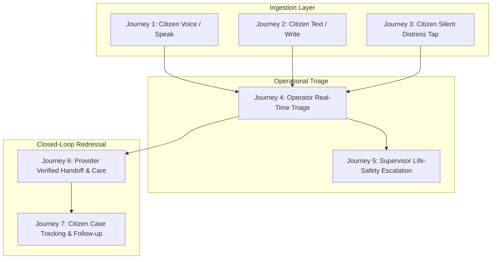

# SAMBAL Product Specification — End-to-End User Journeys

> **Packet ID:** PKT-02  
> **Status:** AUTHORITATIVE SPECIFICATION  
> **Last Updated:** 2026-10-03  
> **Traceability:** Citizen Multi-Channel Ingestion & Operator Triage Workflows  

---

## 1. Journey Architecture Overview

SAMBAL supports multiple distinct, trauma-informed user journeys across citizen intake, operator triage, supervisory escalation, and external provider closed-loop response:

---

## 2. Citizen Journeys

### Journey 1: Citizen Voice / Speak Intake (`SPEAK`)
1. **Entry Point:** Complainant accesses the mobile PWA or calls the 14566 telephony trunk.
2. **Channel Selection:** Selects `[ SPEAK ]` (or stays on telephony voice line).
3. **Language Selection:** Spoken prompt or clean visual tile: English, हिन्दी, मराठी, etc.
4. **Consent Check:** Clear plain audio explanation: *"We will transcribe your words to help an officer review your complaint. We do not store your raw voice without permission. Do you agree?"* Citizen answers *"Yes / हाँ"*.
5. **Continuous Streaming Triage:**
   - Citizen speaks freely in their native dialect or mixed language.
   - Streaming ASR produces partial and final hypotheses in real time.
   - Background intelligence evaluates Immediate Safety, SVI cues, and entity facts.
6. **Confirmation & Next Steps:** System provides tracking ID (`S-2026-XXXX`) and confirms: *"Your grievance has been safely received. A trained helpline officer is reviewing your information right now."*

---

### Journey 2: Citizen Text / Write Intake (`WRITE`)
1. **Entry Point:** Complainant visits the portal on a smartphone or community Common Service Centre (CSC) terminal.
2. **Channel Selection:** Selects `[ WRITE ]`.
3. **Structured / Unstructured Input:** Complainant can paste an existing narrative or type in their own words. Auto-save preserves draft locally to prevent loss during intermittent network drops.
4. **Clarification Prompts:** Gentle, optional prompts: *"When did this happen?", "Do you know who the persons were?", "Are you in a safe place now?"* (Citizen can skip any question).
5. **Submission & Tracking:** Submission generates minimal tracking token without requiring full public Aadhaar disclosure at initial step.

---

### Journey 3: Citizen Silent Distress Intake (`SILENT_TAP`)
1. **Entry Trigger:** Complainant is in a hazardous environment (abuser in the same room, night-time threat, unable to speak safely).
2. **Visual Discretion & Camouflage:**
   - Screen instantly adopts a neutral, non-alarming appearance.
   - Browser tab title changes to a neutral label: *"Gov Portal — Information Services"*.
3. **Zero Audio Generation:** System strictly suppresses all TTS audio, notification chimes, and click sounds.
4. **Tap-Based Micro-Questions:** Instead of typing, user answers via large, discreet tap tiles:
   - *"Are you safe right now?"* `[ YES ]` `[ NO — SOMEONE NEARBY ]` `[ NOT SURE ]`
   - *"Do you need emergency help?"* `[ YES — IMMEDIATELY ]` `[ NO — CALL ME LATER ]`
   - *"Best way to contact you?"* `[ SILENT SMS ]` `[ WHATSAPP ]` `[ DO NOT CALL ]`
5. **Quick Exit:** Persistent `[ QUICK EXIT (ESC) ]` button in the top-right corner. If tapped or if `ESC` key is pressed:
   - Instantly redirects browser to `india.gov.in`.
   - Purges active session storage, cached form values, and input fields.
6. **Operator Interpretation:** The system flags this as **`ELEVATED`** contextual safety concern, alerts the operator to NOT place a voice return call, and queues a discreet silent SMS / chat channel.

---

### Journey 4: Citizen Case Tracking & Never-Repeat-My-Story Follow-Through
1. **Status Query:** Complainant enters their tracking token (`S-2026-9032`) via web or SMS.
2. **Plain-Language Progress Display:**
   - Shows current stage in the Verified Support Hierarchy (e.g. *"Stage 4: Legal Aid Assigned — Adv. Patil is reviewing your police FIR"*).
   - Zero internal model jargon, zero SVI numbers.
3. **Safe Feedback:** Complainant can tap: *"Did the lawyer contact you?"* `[ YES ]` `[ NO ]`.
4. **Never-Repeat-My-Story:** When connected to the lawyer, the citizen is greeted with: *"I have your complaint regarding the September 14th land issue; I see you need bail opposition..."* Citizen does not have to retell the painful story.

---

## 3. Operator & Supervisor Journeys

### Journey 5: Frontline Operator Real-Time Triage
1. **Queue Prioritization:** Operator dashboard orders incoming queues by:
   - Tier 1 Life-Safety Flags (`CRITICAL_REVIEW`) first.
   - High Reported Incident Urgency (`CRITICAL`, `URGENT`) second.
   - SVI Severity (`CRITICAL`, `HIGH`) third.
   - Queue Waiting Age fourth.
2. **Three-Second Visual Scan:** Operator accepts incoming call. Workspace immediately displays:
   - Immediate Safety Badge (Top Left).
   - SVI Vulnerability Band (Top Center).
   - Reported Incident Urgency (Top Right).
3. **Live Evidence Inspector:**
   - Real-time transcript scrolls with keyword and entity highlights.
   - Operator clicks an entity to inspect source snippet, model confidence, and audio timestamp.
4. **Suggested Next Questions:**
   - Pre-approved, trauma-informed prompt tiles appear: *"Are you in a safe room right now?"*
5. **Referral Assembly & Handoff:**
   - Operator selects verified support partner from the real-time directory.
   - System auto-assembles the role-minimized Safe Handoff Dossier.
   - Operator verifies consent and clicks `[ APPROVE & DISPATCH REFERRAL ]`.

---

### Journey 6: Supervisor Life-Safety Escalation
1. **High-Impact Trigger:** System flags `CRITICAL_REVIEW` (active self-harm or violent siege) or operator clicks `[ ESCALATE TO SUPERVISOR ]`.
2. **Audio-Visual Interrupt:** Shift supervisor dashboard displays pinned escalation card.
3. **Silent Co-Listening:** Supervisor joins audio stream silently to assess physical danger and verify location without interrupting operator de-escalation.
4. **Authorized Multi-Agency Action:**
   - Supervisor authorizes warm conference with Tele-MANAS (14416) crisis cell or ERSS 112.
   - Electronic handoff packet transmitted with supervisory digital signature.
   - Audit event logged.

---

### Journey 7: External Provider Verified Handoff & Care
1. **Receipt & Electronic Acknowledgement:** DLSA legal panel or Tele-MANAS cell receives webhook/queue packet and returns `ACKNOWLEDGED`.
2. **Case Assignment:** Provider desk assigns advocate or psychologist (`CONTACT_PENDING`).
3. **Direct Contact:** Provider officer contacts citizen within statutory/policy SLA (`CONTACTED`).
4. **Service Milestone:** Session held or court petition filed (`SERVICE_STARTED`).
5. **Dual-Confirmation Closure:** Provider submits progress update; helpline follow-up desk verifies with citizen; case transitions to `COMPLETED`.
