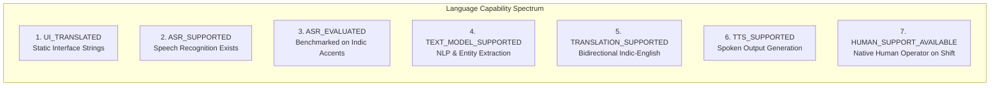

# SAMBAL Product Policy — Multilingual Coverage & Truthful Language Claims

> **Packet ID:** PKT-02  
> **Status:** AUTHORITATIVE POLICY  
> **Last Updated:** 2026-10-03  
> **Traceability:** SIH26093 Multilingual Support Mandate, Schedule VIII Languages  

---

## 1. Truth-State Doctrine in Multilingual AI

A pervasive failure in AI demonstrations and government hackathons is conflating theoretical multilingual coverage with verified, evaluated engineering reality. Claiming "Supports 22 Indian Languages" when an English-trained model merely ingests uncalibrated Google Translate outputs is an ethical violation and technically deceptive.

SAMBAL enforces the **Strict Language Truth-State Doctrine**:
> **A language cannot be claimed as "Supported" in competition, audit, or production unless each individual capability dimension has been verified and benchmarked.**

---

## 2. The 7 Distinct Language Capability Dimensions

Every language recognized in SAMBAL must be explicitly classified across 7 orthogonal capability dimensions:

### Definitions:
1. **`UI_TRANSLATED`:** All static labels, navigation buttons, form inputs, error messages, and trauma-informed guidance strings have been professionally translated, proofread by native speakers, and localized in the UI.
2. **`ASR_SUPPORTED`:** An ASR model architecture (e.g. Whisper-turbo, IndicConformer) possesses an acoustic and language model checkpoint for this language token.
3. **`ASR_EVALUATED`:** The ASR model has been formally evaluated on real-world Indian speech, noisy telephone audio, and dialectal variations with a documented Word Error Rate (WER) and Critical Phrase Recall metric.
4. **`TEXT_MODEL_SUPPORTED`:** Multilingual NLP models (e.g. IndicBERT, multilingual LLM) can extract safety entities, temporal dates, and grievance facts from native script text.
5. **`TRANSLATION_SUPPORTED`:** High-fidelity bidirectional translation exists (e.g. via Bhashini or dedicated translation models) preserving legal terms and negations.
6. **`TTS_SUPPORTED`:** Text-to-Speech synthesis produces natural, empathetic spoken prompts for low-literacy complainants.
7. **`HUMAN_SUPPORT_LANGUAGE_AVAILABLE`:** The physical helpline contact center or Tele-MANAS partner network maintains authenticated human operators on active duty fluent in this language.

---

## 3. Truth-State Language Registry (Packet 02 Authoritative Baseline)

| Language | Code | UI_TRANSLATED | ASR_SUPPORTED | ASR_EVALUATED | TEXT_MODEL_SUPPORTED | TRANSLATION_SUPPORTED | TTS_SUPPORTED | HUMAN_SUPPORT_AVAILABLE | Current Status |
| :--- | :---: | :---: | :---: | :---: | :---: | :---: | :---: | :---: | :--- |
| **English** | `en` | **YES** | **YES** | **YES** (Baseline) | **YES** | **YES** | **YES** | **YES** | **FOUNDATION_READY** |
| **Hindi** | `hi` | **YES** | **YES** | **PENDING (P08)** | **YES** | **YES** | **PENDING** | **YES** (14566 National) | **BASELINE_CANDIDATE** |
| **Marathi** | `mr` | **YES** | **YES** | **PENDING (P08)** | **YES** | **YES** | **PENDING** | **YES** (SLSA / Tele-MANAS) | **BASELINE_CANDIDATE** |
| **Tamil** | `ta` | Planned (P05) | Candidate | Untested | Candidate | Candidate | Planned | **YES** (State Hub) | **PROVISIONAL** |
| **Telugu** | `te` | Planned (P05) | Candidate | Untested | Candidate | Candidate | Planned | **YES** (State Hub) | **PROVISIONAL** |
| **Bengali** | `bn` | Planned (P05) | Candidate | Untested | Candidate | Candidate | Planned | **YES** (State Hub) | **PROVISIONAL** |
| **Kannada** | `kn` | Planned (P05) | Candidate | Untested | Candidate | Candidate | Planned | **YES** (State Hub) | **PROVISIONAL** |
| **Gujarati** | `gu` | Planned (P05) | Candidate | Untested | Candidate | Candidate | Planned | **YES** (State Hub) | **PROVISIONAL** |
| **Odia** | `or` | Planned (P05) | Candidate | Untested | Candidate | Candidate | Planned | **YES** (State Hub) | **PROVISIONAL** |
| **Punjabi** | `pa` | Planned (P05) | Candidate | Untested | Candidate | Candidate | Planned | **YES** (State Hub) | **PROVISIONAL** |

*Doctrine Rule:* In the SIH Hackathon evaluation and competition presentation, SAMBAL shall claim **FULL WORKING BASELINE** exclusively for English, Hindi, and Marathi, with broader languages marked truthfully as **`PROVISIONAL / ROADMAP CANDIDATES`**.

---

## 4. Code-Switching & Dialectal Uncertainty Handling

Spoken discourse in India—especially during emotional crisis—heavily incorporates **Hinglish**, **Maranglish**, regional idioms, and rapid intrasentential code-switching.

### Policy Rules:
1. **No Language Penalization:** The system shall never reject or fail an utterance because it contains mixed languages (e.g. Hindi sentence with English words like "threat", "police station", "date").
2. **Uncertainty Flagging (`LANGUAGE_UNCERTAIN`):** If code-switching causes ASR token confidence to drop below 0.50, the system:
   - Sets `UncertaintyState` to **`LANGUAGE_UNCERTAIN`**.
   - Preserves phonetically transcribed audio snippets in the Evidence Inspector.
   - Alerts the operator to verify dialectal terminology directly with the caller.
3. **Preservation of Raw Utterances:** When translating dialectal expressions into English for the structured fact dossier, the system MUST preserve the original vernacular phrase in quotation marks (e.g. *"accused used caste slur '[Original Word]' in front of neighbors"*).
