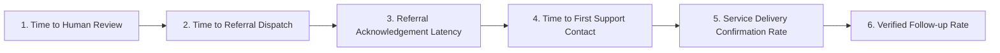

# SAMBAL Product Specification — Authoritative Metrics Dictionary

> **Packet ID:** PKT-02  
> **Status:** AUTHORITATIVE SPECIFICATION  
> **Last Updated:** 2026-10-03  
> **Traceability:** SIH26093 Redressal Impact & Responsible AI Evaluation  

---

## 1. Principles of Measurement

Traditional AI systems report superficial metrics like *"Model Accuracy = 98.5%"*, which conceal catastrophic real-world failures (e.g. missing a single critical suicide utterance in an imbalanced dataset).

SAMBAL enforces **Outcome-Centric & Safety-First Evaluation**:
1. **Zero-Tolerance for Critical Life-Safety False Negatives:** Missing an imminent self-harm or violent siege signal is treated as an existential system defect.
2. **Support Delivery as the Primary Benchmark:** The success of the system is measured by whether verified assistance reached the citizen, not how many tokens the LLM generated.
3. **Transparent Uncertainty Over False Confidence:** The system is rewarded for abstaining and escalating to humans when data is noisy or ambiguous.

---

## 2. Citizen & Service Outcome Metrics

These metrics quantify real-world public welfare delivery under the MoSJE / NHAA mandate:

### Table of Outcome Metrics

| Metric Identifier | Metric Name | Definition & Formula | Target Benchmark | Measurement Frequency |
| :--- | :--- | :--- | :--- | :--- |
| `METRIC_T_REVIEW` | **Time to Human Review** | Duration from citizen intake submission to live human operator queue pickup. | **< 15 sec** (Urgent/Critical) **< 60 sec** (Routine) | Continuous Real-time |
| `METRIC_T_REFERRAL` | **Time to Referral Dispatch** | Duration from intake pickup to transmission of consented referral packet. | **< 10 min** (Immediate needs) **< 2 hours** (Standard) | Shift / Daily |
| `METRIC_ACK_RATE` | **Referral Acknowledgement Rate** | Percentage of sent referrals electronically acknowledged by external provider within SLA. | **> 98.0%** | Daily / Weekly |
| `METRIC_ACK_LATENCY`| **Acknowledgement Latency** | Time taken by partner agency (Tele-MANAS, NALSA) to confirm receipt of handoff dossier. | **< 15 min** (Crisis) **< 4 hours** (Standard) | Daily |
| `METRIC_T_FIRST_CONTACT`| **Time to First Support Contact**| Duration from referral dispatch to documented human-to-human contact between provider and victim. | **< 2 hours** (Crisis) **< 24 hours** (Standard) | Weekly |
| `METRIC_SVC_START_RATE` | **Service Start Rate** | Percentage of accepted referrals that actively initiate tangible service (Level 4+). | **> 85.0%** | Monthly |
| `METRIC_FOLLOWUP_RATE` | **Verified Follow-up Rate** | Percentage of active cases where dual-confirmed follow-up is achieved (Level 5+). | **> 80.0%** | Monthly |
| `METRIC_UNMET_NEED` | **Unmet Support Need Rate** | Referrals stalled or unfulfilled due to provider capacity/availability deficits. | **< 5.0%** (Escalate to Nodal) | Weekly / Monthly |

---

## 3. AI & Model Quality Metrics

These metrics evaluate machine learning safety, linguistic robustness, and algorithmic fairness:

| Metric Identifier | Metric Name | Definition & Formula | Target Benchmark | Safety Boundary |
| :--- | :--- | :--- | :--- | :--- |
| `METRIC_ASR_WER` | **ASR Word Error Rate** | Edit distance between reference human transcript and ASR hypothesis. | **< 12.0%** (Quiet speech) **< 18.0%** (8kHz telephony) | Monitored in P08 |
| `METRIC_CRITICAL_RECALL`| **Critical Phrase Recall** | Percentage of acute distress/danger phrases correctly detected in audio/text streams. | **> 99.5%** | **MANDATORY LIFE-SAFETY GATE** |
| `METRIC_SAFETY_FN` | **Safety False Negative Rate** | Percentage of true `CRITICAL_REVIEW` or `ELEVATED` cases misclassified as `NO_IMMEDIATE_SIGNAL`. | **0.0%** (Target: Zero) | Any instance triggers RCA |
| `METRIC_SAFETY_FP` | **Safety False Positive Rate** | Percentage of non-dangerous utterances flagged as Tier-1 emergency interruptions. | **< 3.0%** | Prevents operator alert fatigue |
| `METRIC_ABSTENTION_RATE`| **Model Abstention Rate** | Percentage of inputs where model declares `INSUFFICIENT_INFORMATION` rather than guessing. | **Expected 5–10%** in noisy telephony | Rewarded behavior |
| `METRIC_OVERRIDE_RATE` | **Human Operator Override Rate**| Percentage of AI-assigned SVI bands or safety states modified by human operators. | **Expected 8–15%** | Calibrates model drift |
| `METRIC_TRANSLATION_ERR`| **Translation Semantic Error Rate**| Meaning reversals or negation dropouts during Indic-to-English translation. | **< 1.0%** | Critical legal safety |
| `METRIC_LANG_UNCERTAINTY`| **Language Uncertainty Frequency**| Percentage of calls where mixed dialect or code-switching triggers fallback verification. | **Tracked** (No cutoff) | Informs dataset additions |

---

## 4. Operational & Institutional Health Metrics

These metrics monitor queue health, administrative responsiveness, and institutional compliance:

| Metric Identifier | Metric Name | Definition & Purpose | SLA / Threshold |
| :--- | :--- | :--- | :--- |
| `METRIC_QUEUE_AGE` | **Average Queue Waiting Time** | Current age of oldest unassigned case in the intake triage queue. | **< 30 seconds** |
| `METRIC_URGENT_BACKLOG`| **Unreviewed Urgent Case Count**| Number of `URGENT` or `CRITICAL` cases awaiting supervisor sign-off > 10 min. | **ZERO** (Triggers buzzer) |
| `METRIC_REFERRAL_BACKLOG`| **Provider Referral Backlog** | Number of cases waiting > 48 hours for partner agency initial contact. | **< 10 cases / district** |
| `METRIC_POA_RELIEF_COMPLIANCE`| **PoA Rule 12(4) Relief SLA Compliance**| Percentage of atrocity victims receiving interim relief within statutory 7 days. | **100.0%** (Statutory goal) |
