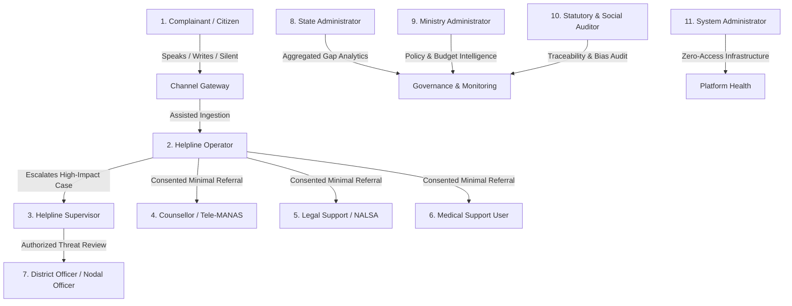

# SAMBAL Product Specification — Persona Directory

> **Packet ID:** PKT-02  
> **Status:** AUTHORITATIVE SPECIFICATION  
> **Last Updated:** 2026-10-03  
> **Traceability:** SIH26093 Core Requirements, PoA Act 1989 / 2016 Rules, NHAA 14566 Triage  

---

## 1. Executive Summary & Persona Governance

SAMBAL is not a generic helpline CRM. It is a specialized, trauma-informed intelligence-and-response layer for victims and complainants accessing the National Helpline Against Atrocities (NHAA - 14566) and the integrated grievance portal under the Ministry of Social Justice and Empowerment (MoSJE / DoSJE).

To prevent cognitive overload, unauthorized data proliferation, and harmful automation, every human user interacts with the system through an explicitly scoped persona. Each persona is constrained by:
1. **Cognitive / Stress Context:** The psychological state and operational reality of the user at the moment of interaction.
2. **Information Needs vs Prohibitions:** Strict role-based access defining what data is essential versus what data is forbidden.
3. **Action Authority:** What the user may initiate, approve, or modify.
4. **Privacy & Legal Boundaries:** Statutory constraints under DPDP Act 2023, PoA Rules 1995 (Rule 12/15), and legal privilege.
5. **Failure Modes & Consequences:** Real-world harms if the persona workflow fails or is designed improperly.

---

## 2. Directory of Personas

---

### Persona 1: The Complainant / Citizen (Victim or Aggrieved Citizen)

- **Role Identifier:** `ROLE_CITIZEN_COMPLAINANT`
- **Profile:** A Scheduled Caste (SC) or Scheduled Tribe (ST) citizen, survivor, or witness accessing NHAA (14566) or the web portal seeking protection, grievance registration, or support services following an atrocity, caste-based harassment, threat of eviction, or denial of rights.
- **Cognitive & Stress Context:** Acute distress, traumatic recall, fear of physical retaliation by influential perpetrators, deep distrust of institutional machinery, fear that calling the helpline will alert the accused. May speak a regional dialect, have low literacy, or be under active surveillance in a shared room.
- **Information Needed:**
  - Clear reassurance that their communication is confidential.
  - Transparent control over how they communicate (Speak, Write, or Silent Tap).
  - Explicit consent choices (what is recorded, what is processed, who receives it).
  - Clear, plain-language confirmation that a trained human will review their case.
  - Plain-language tracking identifier and simple next steps without bureaucratic jargon.
- **Information NOT Needed / Prohibited:**
  - Internal SVI numerical scores (e.g., "Your SVI is 84/100").
  - Machine learning probabilities or confidence metrics (e.g., "78% distress detected").
  - Diagnostic clinical terminology (e.g., "Depression", "Acute Stress Disorder", "Trauma confirmed").
  - Internal database IDs or complex multi-tier status codes.
- **Permitted Actions:**
  - Select communication channel (`SPEAK`, `WRITE`, `SILENT_TAP`).
  - Grant or withhold specific consent items (audio processing, referral sharing, research use).
  - Trigger "Quick Exit" immediately clearing local screen and cache in silent mode.
  - Request emergency callback or decline live voice contact.
  - Access their case status using their minimal authentication token.
- **Privacy Boundary:** Complainant data is protected under the strictest citizen-boundary policy. Contact details are never exposed to external support providers without explicit informed consent.
- **Failure Consequences:** Retraumatization, physical assault if silent exit fails, complete withdrawal from justice mechanisms if distrust is reinforced.

---

### Persona 2: The Helpline Operator (14566 Triage Agent)

- **Role Identifier:** `ROLE_HELPLINE_OPERATOR`
- **Profile:** A trained frontline helpline agent operating in a high-volume call center environment under the MoSJE / DoSJE NHAA setup.
- **Cognitive & Stress Context:** High call volume, time-constrained call quotas, cumulative vicarious trauma from hearing harrowing accounts, risk of alert fatigue if AI surfaces false emergency banners.
- **Information Needed:**
  - Rapid 3-second visual triage: Immediate Safety State, SVI Band, Reported Incident Urgency.
  - Transparent evidence inspector: *Why* did the system highlight this phrase?
  - Model uncertainty indicators: Was the audio noisy? Is the dialect ambiguous?
  - Recommended next questions from pre-approved, trauma-informed prompt templates.
  - One-click access to verified support service directories with real-time status.
- **Information NOT Needed / Prohibited:**
  - Raw unverified perpetrator criminal records (prejudicial to triage).
  - Unsanitized background audio diagnostics or irrelevant telemetry.
- **Permitted Actions:**
  - Accept, modify, or dismiss AI-suggested safety flags with a mandatory audit reason.
  - Edit and correct ASR transcription errors in real time.
  - Select and initiate support service referral packets.
  - Escalate Tier-1 emergency cases to the shift supervisor.
  - Log caller observations and human notes.
- **Privacy Boundary:** Can view caller contact and case facts during active intake; cannot export records, bypass PII redaction in logs, or access unrelated case histories.
- **Failure Consequences:** Missed suicide or active violence signals (false negative); inappropriate police escalation against caller's will (false positive); operator burnout.

---

### Persona 3: The Helpline Supervisor (Shift Lead / Quality Officer)

- **Role Identifier:** `ROLE_HELPLINE_SUPERVISOR`
- **Profile:** A senior social worker, senior triage officer, or shift manager overseeing a team of 15–30 helpline operators.
- **Cognitive & Stress Context:** High operational responsibility, urgent decision-making for life-safety escalations, managing operator throughput while ensuring quality standards.
- **Information Needed:**
  - Live dashboard of Tier-1 escalations, high SVI cases, and operator overrides.
  - Real-time queue age and unreviewed urgent cases.
  - Model disagreement alerts and recurring transcription failure clusters.
  - Operator override audit logs and reason justifications.
- **Information NOT Needed / Prohibited:**
  - Irrelevant individual citizen identifiers unless actively reviewing an escalated case.
- **Permitted Actions:**
  - Authorize high-impact escalations (ERSS 112 emergency handoff review, witness protection review request).
  - Override operator decisions with documented supervisory rationale.
  - Assign or reassign complex cases to specialized operators (e.g. specific regional dialects).
  - Initiate operator debriefs and quality audits.
- **Privacy Boundary:** Full review access to active shift cases; prohibited from bulk data export or commercial disclosure.
- **Failure Consequences:** Delayed emergency response to an active threat; unresolved operator bias; unaddressed operator vicarious trauma.

---

### Persona 4: The Counsellor / Mental Health Professional (Tele-MANAS / District Cell)

- **Role Identifier:** `ROLE_SUPPORT_COUNSELLOR`
- **Profile:** A licensed psychologist, psychiatric social worker, or trained crisis counsellor affiliated with Tele-MANAS (14416) or a district-level mental health clinic.
- **Cognitive & Stress Context:** Focused therapeutic environment, limited session time, needing immediate grounding on the client's psychological vulnerability without forcing them to repeat their story.
- **Information Needed:**
  - Consented mental health handoff packet: Complainant preferred language, primary distress signals, identified coping needs, relevant consented narrative summary.
  - Immediate safety state (to know if crisis de-escalation is needed immediately).
  - Referral history: Previous support contacts and verified outcomes.
- **Information NOT Needed / Prohibited:**
  - Complete legal case documents, FIR drafts, or property dispute evidence.
  - Raw acoustic voice recordings or internal technical model debugging scores.
  - Perpetrator legal accusations unrelated to psychological safety.
- **Permitted Actions:**
  - Acknowledge receipt of referral.
  - Update service delivery status (`CONTACTED`, `APPOINTMENT_SCHEDULED`, `SERVICE_STARTED`, `COMPLETED`).
  - Record therapeutic session outcomes and follow-up recommendations.
  - Trigger urgent re-escalation if client expresses acute suicidal ideation during a session.
- **Privacy Boundary:** Bound by healthcare confidentiality; access strictly limited to assigned clients.
- **Failure Consequences:** Forcing the client to retell their traumatic story (retraumatization); missing critical crisis context; violating therapeutic privilege.

---

### Persona 5: The Legal Aid Support User (NALSA / DLSA Panel Advocate)

- **Role Identifier:** `ROLE_LEGAL_AID_ADVOCATE`
- **Profile:** A panel advocate appointed under the National Legal Services Authority (NALSA) or District Legal Services Authority (DLSA) providing free legal aid under Section 12(b) of the Legal Services Authorities Act, 1987.
- **Cognitive & Stress Context:** Navigating complex statutory procedures under the SC/ST (Prevention of Atrocities) Act, 1989 (including 2016 amendments, Section 15A rights of victims and witnesses), bail opposition, FIR registration, and Special Court trial timelines.
- **Information Needed:**
  - Consented legal aid handoff packet: Date/time/location of incident, nature of alleged atrocity, names/identities of accused, witnesses present, status of police FIR, compensation claim status under Rule 12.
  - Complainant contact details and safe contact windows.
- **Information NOT Needed / Prohibited:**
  - Mental health counselling notes or confidential clinical assessments.
  - Raw acoustic emotional telemetry (not admissible as legal fact and potentially prejudicial).
- **Permitted Actions:**
  - Acknowledge referral and update legal assistance status (`CONTACTED`, `LEGAL_REPRESENTATION_FILED`, `COMPENSATION_APPLIED`).
  - Log court milestone updates (FIR registered, chargesheet filed, victim compensation sanctioned).
  - Request witness protection assessment through the formal Special Court / District Committee channel.
- **Privacy Boundary:** Bound by advocate-client legal privilege; cannot share victim disclosures with opposing counsel or third parties.
- **Failure Consequences:** Expiry of statutory limitation periods; failure to oppose bail for violent perpetrators; victim deprived of mandatory state relief under PoA Rule 12.

---

### Persona 6: The Medical Assistance User (District Hospital / CMO)

- **Role Identifier:** `ROLE_MEDICAL_SUPPORT_USER`
- **Profile:** A government medical officer, forensic medical examiner, or emergency department staff at a District Civil Hospital or Community Health Centre.
- **Cognitive & Stress Context:** Fast-paced clinical environment, documenting injuries for medico-legal cases (MLC) while ensuring physical stabilization.
- **Information Needed:**
  - Reported physical injuries, need for emergency transport/ambulance, special medical needs (e.g., burns, sexual assault forensic protocol, disability assistance).
  - Complainant physical location and emergency contact.
- **Information NOT Needed / Prohibited:**
  - Complete legal case background, property dispute records, or psychological profiling.
- **Permitted Actions:**
  - Acknowledge emergency medical referral.
  - Record admission, treatment status, and medical-legal examination completion.
- **Privacy Boundary:** Medical confidentiality; data shared strictly on a need-to-know emergency treatment basis.
- **Failure Consequences:** Delayed emergency medical care; compromised forensic evidence collection in atrocity cases.

---

### Persona 7: The District Officer (District Magistrate / Nodal Officer under PoA Act)

- **Role Identifier:** `ROLE_DISTRICT_NODAL_OFFICER`
- **Profile:** A District Magistrate (DM), Additional District Magistrate (ADM), or Sub-Divisional Magistrate (SDM) designated as the Nodal Officer under Rule 9 of the SC/ST (PoA) Rules, 1995.
- **Cognitive & Stress Context:** Executive administrative burden, maintaining law and order, preventing caste clashes, coordinating inter-departmental relief, monitoring police investigation timelines.
- **Information Needed:**
  - Incident severity and location mapping for atrocity hotspots.
  - Status of immediate relief disbursement under PoA Rule 12(4) (mandatory within 7 days).
  - Formal witness protection requests from the District Witness Protection Committee.
  - Inter-agency coordination bottlenecks in their district.
- **Information NOT Needed / Prohibited:**
  - Private counselling session details or personal psychological disclosures.
- **Permitted Actions:**
  - Review district-level atrocity triage alerts.
  - Sanction statutory victim compensation payments.
  - Convene District Level Vigilance and Monitoring Committee (DLVMC) reviews.
  - Authorize district administrative protection measures.
- **Privacy Boundary:** Access restricted strictly to cases within their administrative district jurisdiction.
- **Failure Consequences:** Statutory violation of mandatory 7-day relief timelines; failure to protect vulnerable witnesses resulting in witness hostility.

---

### Persona 8: The State Administrator (State Social Justice Department Nodal Officer)

- **Role Identifier:** `ROLE_STATE_ADMINISTRATOR`
- **Profile:** A Principal Secretary, Director, or Nodal Officer in the State Department of Social Justice and Empowerment / Tribal Welfare.
- **Cognitive & Stress Context:** State-wide administrative oversight, legislative assembly questions, budget utilization, monitoring Special Courts and District Committees under PoA Rule 8.
- **Information Needed:**
  - Aggregated district performance metrics: average time to referral, referral acknowledgement rate, service start latency.
  - Resource gap analytics: Districts with severe shortages of panel lawyers, clinical psychologists, or shelter beds.
  - State-wide trends in atrocity complaints, resolution rates, and SVI severity distributions.
- **Information NOT Needed / Prohibited:**
  - Individual citizen PII, identifiable transcripts, or direct case narratives (strictly anonymized/aggregated).
- **Permitted Actions:**
  - Reallocate state support resources (e.g. deploying mobile counselling vans or augmenting legal aid rosters).
  - Generate statutory annual reports for the State Vigilance and Monitoring Committee (SVMC).
  - Configure state-specific follow-up rules and escalation thresholds.
- **Privacy Boundary:** Anonymized and aggregated reporting only; zero access to individual victim PII.
- **Failure Consequences:** Inefficient state budget allocation; unaddressed regional atrocities; systemic failure to hold district administrations accountable.

---

### Persona 9: The Ministry Administrator (MoSJE / DoSJE Central Leadership)

- **Role Identifier:** `ROLE_MINISTRY_ADMINISTRATOR`
- **Profile:** A Joint Secretary, Deputy Secretary, or Program Director at the Ministry of Social Justice and Empowerment (MoSJE), Department of Social Justice and Empowerment (DoSJE), Government of India.
- **Cognitive & Stress Context:** National policy formation, parliamentary reporting, Union budget defense, ensuring NHAA 14566 fulfills its statutory mandate across all States and UTs.
- **Information Needed:**
  - National macro-level metrics: Call volume, triage distribution, national referral completion rates, inter-state disparity indices.
  - System health and SLA compliance across national helpline hubs.
  - Evaluated impact data: Did the AI triage layer reduce time to verified support?
- **Information NOT Needed / Prohibited:**
  - Individual citizen names, phone numbers, addresses, or raw transcripts.
- **Permitted Actions:**
  - Authorize national policy updates, follow-up intervals, and system-wide service taxonomies.
  - Review national audit reports and AI fairness benchmark evaluations.
  - Direct central assistance funds to high-burden states under the centrally sponsored scheme.
- **Privacy Boundary:** Zero PII access. Operates exclusively at national statistical and policy-governance levels.
- **Failure Consequences:** Misinformed national policy decisions; failure to identify systemic institutional failures across states.

---

### Persona 10: The Statutory & Social Auditor (Independent Accountability Officer)

- **Role Identifier:** `ROLE_STATUTORY_AUDITOR`
- **Profile:** An officer from the National Commission for Scheduled Castes (NCSC), National Commission for Scheduled Tribes (NCST), Comptroller and Auditor General (CAG), or an authorized academic/civil-society social audit team.
- **Cognitive & Stress Context:** Methodical, adversarial scrutiny, verifying compliance with constitutional guarantees (Articles 15, 17, 21), statutory mandates, DPDP Act 2023, and algorithmic fairness.
- **Information Needed:**
  - Full end-to-end provenance traces: Why was a case classified as Low SVI? What models were invoked?
  - Model override logs: How often do human operators reject AI suggestions, and for what reasons?
  - Bias and disparity audits across gender, language, dialect, and geographic region.
  - Verification that citizen consent was captured, honored, and never bypassed.
- **Information NOT Needed / Prohibited:**
  - Direct raw PII unless specifically empowered by a statutory subpoena / court order. Pseudonymized audit records must be used by default.
- **Permitted Actions:**
  - Inspect audit trails, model version histories, and prompt execution logs.
  - Run algorithmic fairness and parity evaluations.
  - Issue formal audit findings and compliance notices.
- **Privacy Boundary:** Pseudonymized audit sandbox access; prohibited from commercial or unauthorized data handling.
- **Failure Consequences:** Undetected algorithmic bias against specific marginalized communities; unchecked administrative neglect; violation of statutory victim rights.

---

### Persona 11: The System Administrator (DevSecOps / SRE)

- **Role Identifier:** `ROLE_SYSTEM_ADMINISTRATOR`
- **Profile:** Infrastructure and site reliability engineers maintaining the containerized platform, database clusters, MinIO storage, and network perimeters.
- **Cognitive & Stress Context:** High availability (99.9% uptime), sub-second latency, zero data loss, impenetrable cyber defense against DDoS and state-level threat actors.
- **Information Needed:**
  - System performance telemetry: CPU/GPU utilization, connection pools, API error rates, memory usage.
  - Container health, backup statuses, and cryptographic integrity verifications.
- **Information NOT Needed / Prohibited:**
  - **Zero Content Access:** System administrators have zero access to decrypted citizen narratives, transcripts, or counselling notes.
- **Permitted Actions:**
  - Manage infrastructure deployments, rollbacks, and database backups.
  - Configure network firewalls, rate limiters, and secrets rotation.
  - Monitor system logs (which strictly enforce PII redaction and credential masking).
- **Privacy Boundary:** Zero business/citizen data access; infrastructure telemetry only.
- **Failure Consequences:** System downtime during crisis hours; data breach leaking sensitive victim identities.

---

## 3. Persona Comparison & Governance Matrix

| Persona | Primary Goal | PII Access Level | AI Exposure Level | Consequential Action Power | Primary Risk |
| :--- | :--- | :--- | :--- | :--- | :--- |
| **Complainant** | Obtain urgent protection & verified help | Full (Own data only) | Zero jargon (plain explanations) | Full consent control | Retraumatization, physical danger |
| **Operator** | Rapid triage & referral preparation | Full (Active intake only) | Full (3D triage, Inspector, Guidance) | Suggest & prepare referrals | False negatives, alert fatigue |
| **Supervisor** | Quality oversight & crisis escalation | Full (Shift cases) | Full + Disagreement & Override logs | Authorize emergency handoffs | Delayed emergency response |
| **Counsellor** | Psychological de-escalation & therapy | Minimal (Consented mental health) | Low (Distress indicators, safety state) | Log session outcomes | Narrative duplication |
| **Legal Aid** | Legal assistance & statutory relief | Minimal (Consented facts & FIR info) | Low (Incident facts, urgency level) | File legal petitions | Expired statutory deadlines |
| **Medical Staff** | Physical stabilization & MLC documentation | Minimal (Injury & emergency info) | Zero (Clinical facts only) | Record medical care | Delayed trauma care |
| **District Officer** | Administrative protection & compensation | Regional / District aggregated + cases | Medium (Hotspots, urgency trends) | Sanction statutory relief | Delayed 7-day relief |
| **State Admin** | State-wide resource orchestration | Anonymized / Aggregated only | High (Macro trends, capacity models) | Allocate state budget | Regional service deficits |
| **Ministry Admin** | National policy & scheme monitoring | National Statistical only | High (Macro intelligence, impact KPIs) | Update national policies | Misaligned national priorities |
| **Auditor** | Statutory accountability & fairness audit | Pseudonymized / Audit sandbox | Full (Provenance, bias audits, logs) | Issue audit findings | Undetected algorithmic bias |
| **SysAdmin** | Infrastructure uptime & security | Zero (Strictly prohibited) | Zero (Telemetry & metrics only) | Infrastructure operations | System failure or breach |
