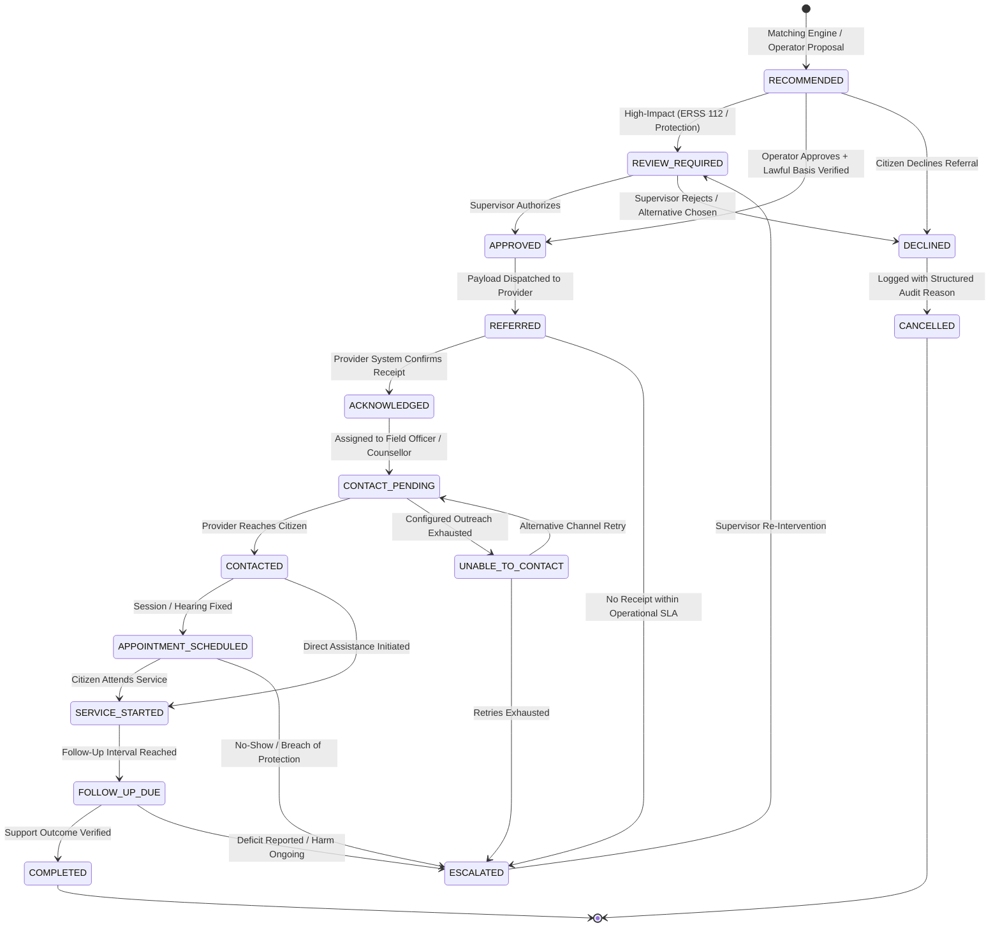

# SAMBAL Product Specification — Referral State Machine & Verified Support
## Closed-Loop Service Lifecycle, Multi-Tier Outcome Evidence & Configurable Operations

> **Packet ID:** PKT-02R  
> **Status:** AUTHORITATIVE SPECIFICATION  
> **Evaluation Date:** 2026-10-03  
> **Traceability:** SIH26093 Closed-Loop Support & Verified Redressal Outcomes  
> **Policy Source Classes:** `INTERNAL_SAFETY_POLICY` / `PILOT_CONFIGURATION` (Operational SLAs) vs `STATUTORY` (PoA Rule 12(4) relief)

---

## 1. The Core Product USP: Answering "Did Support Actually Arrive?"

A fundamental flaw in existing public grievance helplines is that a case is marked "Resolved" or "Closed" the moment a ticket is transferred or a phone number is given to the citizen. In reality, the victim often never receives a call, face-to-face assistance is denied, or the referral gets lost in bureaucratic silos.

SAMBAL establishes a closed-loop **Referral Lifecycle State Machine** governed by the project's defining principle:
> **A recommendation is NOT an outcome.**  
> **A referral is NOT an outcome.**  
> Delivered support begins at `SERVICE_STARTED`, and verified delivery is evaluated through explicit evidence tiers.

---

## 2. Separation of Referral State, Outcome Evidence, and Case Status

To prevent operational deadlocks and relational conflation, the system separates three distinct dimensions:

```text
┌─────────────────────────────────────────────────────────────────────────────┐
│ 1. REFERRAL OPERATIONAL STATE                                               │
│    Lifecycle of the dispatch task to the external agency                    │
│    (RECOMMENDED -> APPROVED -> REFERRED -> CONTACTED -> COMPLETED)          │
├─────────────────────────────────────────────────────────────────────────────┤
│ 2. SUPPORT OUTCOME EVIDENCE (SupportOutcomeEvidence)                        │
│    Verification confidence and provenance regarding delivery                │
│    (UNVERIFIED, PROVIDER_CONFIRMED, CITIZEN_CONFIRMED, DUAL_CONFIRMED,       │
│     DOCUMENT_CONFIRMED, UNABLE_TO_VERIFY)                                   │
├─────────────────────────────────────────────────────────────────────────────┤
│ 3. CASE ADMINISTRATIVE STATUS                                               │
│    Administrative redressal status of the overall citizen docket            │
│    (INTAKE, ACTIVE_INVESTIGATION, MONITORING, ADMINISTRATIVELY_CLOSED)       │
└─────────────────────────────────────────────────────────────────────────────┘
```

### Invariant: `Referral.COMPLETED != Case.CLOSED`
A single grievance case may generate multiple referrals across different domains (e.g. NALSA for bail opposition, Tele-MANAS for trauma counselling, Shelter for emergency relocation). Closing one referral does **not** close the case. Case closure requires authorized administrative sign-off by a designated District Officer or Supervisor.

---

## 3. The 15-State Referral Lifecycle



---

## 4. State Definitions & Flexible Completion Semantics

### State 12: `COMPLETED` (Terminal Operational State)
- **Meaning:** The referral workflow has concluded its operational cycle.
- **Completion Evidence Rules:** Dual confirmation (`DUAL_CONFIRMED`) is the **gold standard**, but is **not** the sole operational way to close a referral. Realistic public administration scenarios must not deadlock:
  1. **Dual Confirmation (`DUAL_CONFIRMED`):** Both provider and citizen explicitly confirm adequate support delivery. (Highest evidentiary tier).
  2. **Citizen-Only Confirmation (`CITIZEN_CONFIRMED`):** Citizen confirms support arrived, even if provider administrative sync is pending.
  3. **Document-Verified Delivery (`DOCUMENT_CONFIRMED`):** Official documentary evidence uploaded (e.g. Special Court order showing legal aid vakalatnama filed, FIR registration receipt, discharge slip).
  4. **Provider-Only Confirmation (`PROVIDER_CONFIRMED`):** Provider certifies delivery with service documentation where citizen declined follow-up or requested no further calls.
  5. **Unable to Verify (`UNABLE_TO_VERIFY`):** Follow-up attempts exhausted without citizen response, but provider confirms service attempted. **`UNABLE_TO_VERIFY` does NOT mean "support failed";** it records an honest epistemic boundary.
- **Actor:** Helpline Follow-Up Officer or Supervisor.

### State 13: `UNABLE_TO_CONTACT` (Configurable Outreach Policy)
- **Policy Decoupling:** The system does **not** hardcode "3 attempts over 48 hours" into code or database constraints.
- Outreach parameters are defined in a versioned, configurable `ContactAttemptPolicy`:
  ```typescript
  interface ContactAttemptPolicy {
    policy_id: string;
    max_attempts: number; // default: 3 (PILOT_CONFIGURATION)
    minimum_spacing_hours: number; // default: 12 (PILOT_CONFIGURATION)
    safe_contact_window_start: string; // e.g. "09:00"
    safe_contact_window_end: string; // e.g. "18:00"
    alternative_channel_allowed: boolean; // SMS/IVR fallback
    policy_source_class: "PILOT_CONFIGURATION";
  }
  ```

---

## 5. Definition of "Verified Support" Hierarchy

To prevent premature claims of success in dashboards and reporting, SAMBAL codifies 7 strict **Verified Support Levels**:

```text
▲  HIGHEST PROOF OF IMPACT
│
├── Level 6: COMPLETED (Verified via Dual / Document Confirmation)
│   Both citizen and provider confirm support was successfully rendered, OR verified by legal/clinical records.
│
├── Level 5: FOLLOW_UP_CONFIRMED
│   Citizen confirms to independent helpline follow-up that support actually arrived.
│
├── Level 4: SERVICE_STARTED
│   Tangible intervention actively initiated (counselling session 1 held, FIR filed, relief disbursement).
│
├── Level 3: CONTACTED
│   First human-to-human contact established between provider and citizen.
│
├── Level 2: ACKNOWLEDGED
│   External agency confirms receipt and case docketing in their system.
│
├── Level 1: REFERRED
│   Electronic packet dispatched from helpline (NO proof of arrival).
│
└── Level 0: RECOMMENDED
    Internal AI/operator proposal only (ZERO real-world assistance).
▼  LOWEST LEVEL
```

### Reporting Mandate:
- Public metrics and judge demonstrations must clearly report counts at each distinct level.
- **`Level 0 (RECOMMENDED)` and `Level 1 (REFERRED)` CANNOT be counted as "Assisted Citizens" or "Resolved Cases".** Only Levels 4, 5, and 6 represent delivered support.

---

## 6. Follow-Up Policy Architecture & SLA Classification

Follow-up intervals are configurable by policy rule based on the **Reported Incident Urgency** and **Support Service Type**. 

### Classification of Time Targets:
All target timeframes below are classified as **`INTERNAL_DESIGN_TARGET` / `PILOT_CONFIGURATION`**, unless explicitly grounded in statutory law:

| Urgency & Service Category | First Check Target | Escalation Target | Policy Source Classification | Statutory Basis / Context |
| :--- | :---: | :---: | :--- | :--- |
| **CRITICAL + EMERGENCY_SUPPORT** | 2 hours | 4 hours | `INTERNAL_SAFETY_POLICY` | Emergency life-safety monitoring protocol. |
| **URGENT + COUNSELLING** | 12 hours | 24 hours | `PILOT_CONFIGURATION` | Psychosocial crisis stabilization benchmark. |
| **PRIORITY + LEGAL_AID** | 48 hours | 72 hours | `PILOT_CONFIGURATION` | Legal representation and bail response window. |
| **ROUTINE + SOCIAL_WELFARE** | 7 days | 14 days | `PILOT_CONFIGURATION` | Administrative welfare processing schedule. |
| **Statutory Relief Disbursement** | 7 days | 7 days | **`STATUTORY`** | **Rule 12(4), SC/ST (PoA) Rules, 1995:** Mandatory relief in cash or kind within 7 days. |
