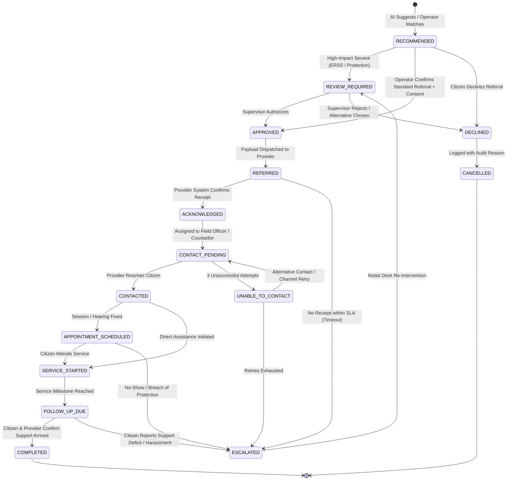

# SAMBAL Product Specification — Referral State Machine & Verified Support

> **Packet ID:** PKT-02  
> **Status:** AUTHORITATIVE SPECIFICATION  
> **Last Updated:** 2026-10-03  
> **Traceability:** SIH26093 Closed-Loop Support & Verified Redressal Outcomes  

---

## 1. The Core Product USP: Answering "Did Support Actually Arrive?"

A fundamental flaw in existing public grievance helplines is that a case is marked "Resolved" or "Closed" the moment a ticket is transferred or a phone number is given to the citizen. In reality, the victim often never receives a call, face-to-face assistance is denied, or the referral gets lost in bureaucratic silos.

SAMBAL establishes a closed-loop **Referral Lifecycle State Machine** governed by the project's defining principle:
> **A recommendation is NOT an outcome.**  
> A case cannot be certified as resolved until **Verified Support** is confirmed by both the provider and the citizen.

---

## 2. The 15-State Referral Lifecycle



---

## 3. Comprehensive State Definitions & Transition Rules

### State 1: `RECOMMENDED`
- **Meaning:** The system matching engine or operator has identified a candidate service pathway based on grievance facts.
- **Actor:** AI Engine or Frontline Operator.
- **Consent Gate:** Proposed to complainant; waiting for consent.
- **Next States:** `REVIEW_REQUIRED`, `APPROVED`, `DECLINED`.

### State 2: `REVIEW_REQUIRED`
- **Meaning:** Referral involves high-impact interventions (ERSS 112 emergency handoff, Witness Protection application, or inter-state transfer) requiring administrative clearance.
- **Actor:** Shift Supervisor / District Nodal Officer.
- **Next States:** `APPROVED`, `DECLINED`.

### State 3: `APPROVED`
- **Meaning:** The referral has been accepted by the operator (and supervisor if required), and explicit informed consent has been obtained from the complainant.
- **Actor:** Operator or Supervisor.
- **Data Payload Formed:** Minimized, role-scoped handoff dossier generated.
- **Next States:** `REFERRED`, `CANCELLED`.

### State 4: `DECLINED`
- **Meaning:** Complainant explicitly opted out of this specific service, or supervisor rejected the referral as inappropriate.
- **Actor:** Complainant or Supervisor.
- **Audit Mandate:** Structured reason code captured (e.g. `DECLINED_BY_CITIZEN_PREFERS_PRIVATE_LAWYER`).
- **Next States:** `CANCELLED` (terminal for this referral).

### State 5: `REFERRED`
- **Meaning:** Handoff packet has been securely transmitted to the receiving provider via API webhook, secure portal queue, or verified telephony bridge.
- **Actor:** SAMBAL Channel Gateway.
- **Next States:** `ACKNOWLEDGED`, `ESCALATED` (if SLA breached).

### State 6: `ACKNOWLEDGED`
- **Meaning:** The receiving partner agency (e.g. Tele-MANAS Cell or DLSA Front Office) has electronically confirmed receipt and entered the record into their intake queue.
- **Actor:** Partner Agency Webhook / Receiving Officer.
- **Next States:** `CONTACT_PENDING`.

### State 7: `CONTACT_PENDING`
- **Meaning:** Referral has been assigned to an individual case worker, advocate, or doctor; outreach to citizen is pending.
- **Actor:** Provider Desk.
- **Next States:** `CONTACTED`, `UNABLE_TO_CONTACT`.

### State 8: `CONTACTED`
- **Meaning:** Provider officer has successfully spoken to or met with the complainant.
- **Actor:** Case Worker / Advocate / Counsellor.
- **Verification Data:** Date/time of contact, channel used, safe contact confirmation.
- **Next States:** `APPOINTMENT_SCHEDULED`, `SERVICE_STARTED`.

### State 9: `APPOINTMENT_SCHEDULED`
- **Meaning:** A formal counselling session, court filing date, hospital examination, or relief hearing has been scheduled.
- **Actor:** Provider Officer.
- **Verification Data:** Appointment date, venue/link, assigned professional.
- **Next States:** `SERVICE_STARTED`, `ESCALATED` (if missed).

### State 10: `SERVICE_STARTED`
- **Meaning:** Concrete assistance is actively underway (e.g. counselling therapy in progress, FIR registered, bail opposition petition filed in Special Court, medical treatment administered).
- **Actor:** Provider Officer.
- **Next States:** `FOLLOW_UP_DUE`.

### State 11: `FOLLOW_UP_DUE`
- **Meaning:** Time interval reached where the helpline is scheduled to contact the citizen to verify service adequacy, physical safety, and redressal progress.
- **Actor:** Automated Policy Scheduler.
- **Next States:** `COMPLETED`, `ESCALATED`.

### State 12: `COMPLETED` (Terminal Success)
- **Meaning:** Dual-confirmation achieved: Provider confirms service delivered, and complainant confirms support was received and adequate.
- **Actor:** Helpline Follow-up Officer.
- **Audit Mandate:** Final outcome record signed off. Case archived.

### State 13: `UNABLE_TO_CONTACT`
- **Meaning:** Provider attempted outreach 3 times over 48 hours without citizen answering (e.g. phone switched off or out of coverage).
- **Actor:** Provider Officer.
- **Next States:** `CONTACT_PENDING` (via secondary emergency contact), `ESCALATED`.

### State 14: `ESCALATED`
- **Meaning:** SLA breach (unacknowledged referral), failure of contact, provider rejection, or complainant reporting ongoing threats during follow-up.
- **Actor:** System Scheduler or Complainant.
- **Next States:** `REVIEW_REQUIRED` (Supervisor Intervention).

### State 15: `CANCELLED` (Terminal Exit)
- **Meaning:** Referral terminated due to citizen withdrawal, duplicate docket, or supervisor determination.
- **Actor:** Operator or Supervisor.

---

## 4. Definition of "Verified Support" Hierarchy

To prevent premature claims of success in dashboards and reporting, SAMBAL codifies 7 strict **Verified Support Levels**:

```text
▲  HIGHEST PROOF OF IMPACT
│
├── Level 6: COMPLETED
│   Both citizen and provider confirm support was successfully rendered and resolved.
│
├── Level 5: FOLLOW_UP_CONFIRMED
│   Citizen confirms to independent helpline follow-up that support actually arrived.
│
├── Level 4: SERVICE_STARTED
│   Tangible intervention actively initiated (counselling session 1 held, FIR filed).
│
├── Level 3: CONTACTED
│   First human-to-human contact established between provider and citizen.
│
├── Level 2: ACKNOWLEDGED
│   External agency confirms receipt and case docketing in their system.
│
├── Level 1: REFERRED
│   Electronic packet dispatched from helpline (NO proof of arrival).
│
└── Level 0: RECOMMENDED
    Internal AI/operator proposal only (ZERO real-world assistance).
▼  LOWEST LEVEL
```

### Reporting Mandate:
- Public metrics and judge demonstrations must clearly report counts at each distinct level.
- **`Level 0 (RECOMMENDED)` and `Level 1 (REFERRED)` CANNOT be counted as "Assisted Citizens" or "Resolved Cases".** Only Levels 4, 5, and 6 represent delivered support.

---

## 5. Follow-Up Policy Architecture

Follow-up intervals are configurable by policy rule based on the **Reported Incident Urgency** and **Support Service Type**:

```typescript
export interface FollowUpSchedule {
  urgency: ReportedUrgencyLevel;
  service_type: SupportServiceType;
  first_check_hours: number;
  max_wait_to_contact_hours: number;
  mandatory_escalation_hours: number;
}
```

### Default Baseline Intervals:
- **Emergency / Active Violence (`CRITICAL` + `EMERGENCY_SUPPORT`):**
  - First Check: **2 hours** post-handoff.
  - Escalation SLA: **4 hours** if unacknowledged.
- **High Vulnerability / Crisis Counselling (`URGENT` + `COUNSELLING`):**
  - First Check: **12 hours** post-referral.
  - Escalation SLA: **24 hours** if uncontacted.
- **Legal Aid / FIR Assistance (`PRIORITY` + `LEGAL_AID`):**
  - First Check: **48 hours** post-referral.
  - Escalation SLA: **72 hours** if lawyer unassigned.
- **Routine Welfare / Scholarship (`ROUTINE` + `SOCIAL_WELFARE_SUPPORT`):**
  - First Check: **7 days** post-referral.
  - Escalation SLA: **14 days** if unacknowledged.
