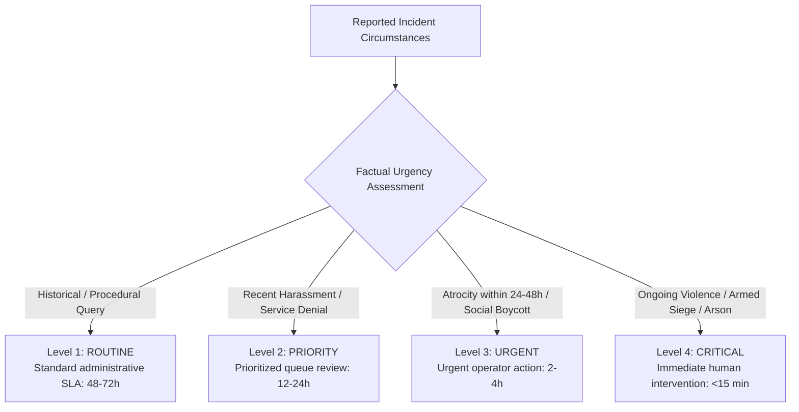

# SAMBAL Product Policy — Reported Incident Urgency

> **Packet ID:** PKT-02  
> **Status:** AUTHORITATIVE POLICY  
> **Last Updated:** 2026-10-03  
> **Traceability:** SIH26093 Triage Efficiency Requirements, SC/ST (PoA) Act Framework  

---

## 1. Principle & Operational Purpose

Reported Incident Urgency answers the objective operational question:
> **"How urgently should the reported circumstances receive authorized human review based on the facts reported?"**

### 1.1 Total Independence from Emotional Affect
Reported Incident Urgency evaluates **factual circumstances**, not emotional presentation.
- An individual speaking with complete composure about an armed mob encircling their community must be classified as **`CRITICAL`** incident urgency.
- An individual in tears recounting a painful event that occurred two years ago where no current threat exists must be classified as **`ROUTINE`** or **`PRIORITY`** incident urgency (while receiving compassionate **`HIGH`** SVI psychological support).

### 1.2 Prohibited Judicial Determinations
The system is an administrative intake triage tool, NOT a court of law or judicial magistrate. The system MUST NEVER attempt to determine:
1. **Legal Guilt:** Whether an accused individual or group is guilty of an offence.
2. **Complainant Veracity:** Whether the complainant is "truthful" or "lying" (zero deception-detection algorithms).
3. **Legal Proof:** Whether an offence under IPC/BNS or SC/ST (PoA) Act has been established to the criminal evidentiary standard.
4. **Statutory Applicability:** Whether sections 3(1) or 3(2) of the PoA Act definitively apply (this is the sole legal prerogative of the Police Investigating Officer and Special Court).

---

## 2. The 4 Incident Urgency Levels

---

### Level 1: `ROUTINE`
- **Definition:** The reported incident represents a historical event, an administrative query regarding existing government benefits, a procedural follow-up on a long-standing grievance, or a civil boundary dispute with zero reported threats of physical harm.
- **Evidence Patterns:**
  - Incident occurred more than 30 days ago with no subsequent contact or threats from the accused.
  - Queries regarding status of previous scholarship, pension, or welfare applications.
  - General legal inquiries regarding procedural rights without active court deadlines.
- **Expected Human Actions:**
  - Standard grievance docketing.
  - Queueing for standard administrative processing (SLA: 48–72 hours).
  - Providing relevant scheme information or standard legal aid appointment.

---

### Level 2: `PRIORITY`
- **Definition:** The incident involves recent non-violent harassment, discriminatory exclusion, institutional denial of basic public services (e.g. denial of water access, ration shop refusal, school discrimination), or property encroachment where tensions are escalating but no immediate violence has occurred.
- **Evidence Patterns:**
  - Denial of access to common public resources based on caste within the past 7 days.
  - Verbal caste abuse in a public space without brandishing weapons or physical assault.
  - Formal complaint filed at police station without receipt of an FIR copy (Rule 5(1) violation).
- **Expected Human Actions:**
  - Prioritized operator intake (SLA: 12–24 hours).
  - Routing to District Nodal Officer / Social Welfare Officer for verification under PoA Rule 9.
  - Scheduling consultation with NALSA/DLSA panel lawyer for FIR registration assistance.

---

### Level 3: `URGENT`
- **Definition:** A severe caste atrocity occurring within the past 24–48 hours, active intimidation or coercion to withdraw an existing police complaint, social boycott imposed on an entire community, or urgent medical needs arising from an assault.
- **Evidence Patterns:**
  - Physical battery, grievous hurt, or sexual harassment occurring within 24–48 hours where victim has not received medical examination.
  - Panchayat or dominant group decreeing a social boycott (cutting off electricity, water, groceries, or agricultural labor).
  - Accused out on bail actively threatening witnesses before trial.
  - Destruction of crop, demolition of dwelling, or denial of burial ground.
- **Expected Human Actions:**
  - Urgent operator dispatch and supervisory notification (SLA: 2–4 hours).
  - Immediate alert to District Magistrate / Superintendent of Police under PoA Rule 12.
  - Preparing immediate medical assistance and interim relief claim under PoA Rule 12(4).
  - Expediting legal counsel appointment to oppose bail or file protection petition.

---

### Level 4: `CRITICAL`
- **Definition:** Imminent or actively unfolding violent atrocity, armed mob encirclement, arson of homes/dwellings, active siege of an SC/ST locality, or imminent physical danger to human life.
- **Evidence Patterns:**
  - Physical assault or arson actively taking place during or immediately preceding the call.
  - Armed perpetrators surrounding the victim's house or blocking escape routes.
  - Direct, specific threats to kill the complainant or family members tonight/within hours.
  - Serious life-threatening injuries untreated and victims trapped.
- **Expected Human Actions:**
  - **Immediate Life-Safety Escalation (SLA: < 15 minutes).**
  - Shift supervisor immediately notified via high-priority audio-visual interrupt.
  - Rapid conference with ERSS 112 emergency control room (authorized by human supervisor).
  - Immediate alert transmitted to District Superintendent of Police and District Magistrate.
  - Activating emergency shelter or police escort protocols.

---

## 3. Orthogonal Comparison & Golden Test Cases

To demonstrate that Incident Urgency cannot be inferred from SVI or emotional affect, the following two canonical cases form mandatory automated golden tests:

### Golden Case 1: Composed Caller with Imminent Physical Peril
- **Complainant Statement:**
  > *"I am calling from village Rampur. The dominant caste panchayat has decided to burn our colony tonight because my brother filed a complaint against them. Three tractors of armed men are gathering at the village square. I am speaking in a low, composed voice so my family does not panic."*
- **Acoustic / Affective Signal:**
  - Pitch: Steady, low variance.
  - Speech Rate: Measured, clear.
  - Tremor: Low.
  - Affective Classification: Composed / Calm.
- **System Assessment:**
  - **Dimension A: Immediate Safety:** **`CRITICAL_REVIEW`** (Imminent armed mob attack).
  - **Dimension B: SVI (Vulnerability):** **`MODERATE`** (Verbal affect composed; community vulnerability high).
  - **Dimension C: Reported Incident Urgency:** **`CRITICAL`** (Mass arson threat within hours).
- **Correct System Behavior:**
  - System flags **`CRITICAL`** Incident Urgency and **`CRITICAL_REVIEW`** Immediate Safety.
  - Overrides acoustic calm. Factual severity drives immediate Tier-1 emergency supervisory intervention.

---

### Golden Case 2: Highly Distressed Caller Recounting Historical Atrocity
- **Complainant Statement:**
  > *"I cannot stop crying... three years ago they attacked our home and killed my uncle... the court acquitted them yesterday... I am completely broken... I am sitting in my sister's house in Delhi, I am physically safe here, but my soul is dead."*
- **Acoustic / Affective Signal:**
  - Pitch: High variance, cracked voice.
  - Pauses: Long, weeping pauses (> 4.5s).
  - Energy: High emotional arousal, hyperventilation.
  - Affective Classification: Acute Grief / Severe Distress.
- **System Assessment:**
  - **Dimension A: Immediate Safety:** **`NO_IMMEDIATE_SIGNAL`** (Physically safe in Delhi, no active violence, no present self-harm intent).
  - **Dimension B: SVI (Vulnerability):** **`HIGH`** (Profound grief, trauma recall, psychological breakdown).
  - **Dimension C: Reported Incident Urgency:** **`PRIORITY`** (Acquittal follow-up / appeal options; no physical attack in progress).
- **Correct System Behavior:**
  - System flags **`HIGH`** SVI and **`PRIORITY`** Incident Urgency.
  - Operator provides compassionate, unhurried listening and arranges a warm Tele-MANAS counselling referral and High Court legal aid appeal consultation.
  - Strictly prohibits dialing 112 or police emergency dispatch.

---

## 4. Summary Matrix of Incident Urgency vs Response

| Incident Urgency Level | Core Evidence Criteria | Mandatory Human Action | Target SLA | Consequential Authority Required |
| :--- | :--- | :--- | :--- | :--- |
| **`ROUTINE`** | Historical (>30d), administrative query, civil boundary dispute | Docket complaint, standard legal info | 48–72 hours | Frontline Operator |
| **`PRIORITY`** | Denial of public services, recent harassment, unprovided FIR copy | Queue prioritization, Social Welfare verification | 12–24 hours | Frontline Operator + Nodal Desk |
| **`URGENT`** | Atrocity within 24–48h, social boycott, witness intimidation | Expedited medical aid, PoA Rule 12 relief, bail opposition | 2–4 hours | Operator + District Nodal Officer |
| **`CRITICAL`** | Ongoing physical assault, armed mob siege, arson, imminent death threat | Immediate supervisory escalation, ERSS 112 handoff review | < 15 minutes | Supervisor Authorization Mandatory |
