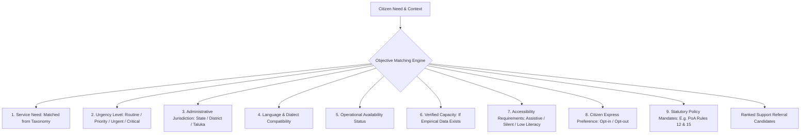

# SAMBAL Product Policy — Resource Routing & Support Allocation
## Objective Multi-Criteria Matching, Status Independence & Ethical Safeguards

> **Packet ID:** PKT-02R  
> **Status:** AUTHORITATIVE POLICY  
> **Evaluation Date:** 2026-10-03  
> **Traceability:** SIH26093 Resource Allocation & Ethical AI Requirements  
> **Policy Source Classes:** `INTERNAL_SAFETY_POLICY` (Matching logic) / `STATUTORY` (Section 15A PoA victim rights)

---

## 1. Principle of Transparent & Objective Routing

In a public welfare and justice system serving marginalized communities, algorithmic opacity and biased resource distribution can reinforce existing caste inequalities. 

SAMBAL enforces **Transparent, Auditable, and Objective Routing**:
- Every service referral recommendation must be explainable in plain terms.
- Routing decisions must be based strictly on legitimate operational criteria.
- Any attempt to use discriminatory, speculative, or unscientific profiling is fundamentally prohibited by system architecture.

---

## 2. Permitted Routing Criteria

The matching engine may evaluate **only** the following 9 objective factors:



### Detailed Criterion Definitions:
1. **Service Need:** Exact match between the elicited grievance need and the 12-category service taxonomy (e.g. physical injury matches `MEDICAL_ASSISTANCE`; trauma recall matches `COUNSELLING`).
2. **Reported Incident Urgency:** Higher urgency matches providers with faster operational response times (e.g. `CRITICAL` matches 24/7 emergency desks; `ROUTINE` matches standard legal aid clinics).
3. **Administrative Jurisdiction:** Strict geographic alignment with the citizen's location (District, Sub-Division, Taluka) to ensure statutory officers under the PoA Act have legal jurisdiction.
4. **Language & Dialect Compatibility:** Matches the complainant's spoken or preferred language with providers capable of native communication (e.g. Marathi speaker routed to Maharashtra DLSA panel lawyer).
5. **Operational Availability Status:** Evaluates verified current operational status independently of endpoint integration or data freshness (`availability_status`: OPEN, CLOSED, ON_DUTY).
6. **Verified Capacity (Strict Standard):** Capacity (`capacity_status`: AVAILABLE, LIMITED, FULL, UNKNOWN) may **only** be factored in if direct, verified data exists (e.g. shelter bed counts). The system **must not** estimate or fabricate hypothetical capacity metrics, and must never infer capacity from contact freshness.
7. **Accessibility Requirements:** Specialized routing for complainants with hearing/speech disabilities (routing to text/silent queues or sign language interpreters) or low literacy (voice/telephony preference).
8. **Citizen Express Preference:** The complainant's explicit choice overrides algorithmic ranking (e.g. complainant requests an NGO legal clinic rather than government legal services).
9. **Statutory Policy Mandates:** Enforces statutory guidelines (e.g. Section 15A of PoA Act mandating free travel and maintenance allowance for victims attending proceedings).

---

## 3. Separation of Service Attributes (Schema Boundary)

To ensure high data fidelity in Packet 03 database modeling, the matching engine evaluates these 5 dimensions as completely independent attributes:

```text
┌───────────────────────────────┬─────────────────────────────────────────────┐
│ Dimension                     │ Permitted Values / Meaning                  │
├───────────────────────────────┼─────────────────────────────────────────────┤
│ 1. freshness_status           │ VERIFIED_CURRENT, STALE, UNKNOWN             │
│                               │ Currency of directory & contact information.│
├───────────────────────────────┼─────────────────────────────────────────────┤
│ 2. integration_status         │ NOT_CONFIGURED, SANDBOX, ADAPTER_READY,     │
│                               │ LIVE, DEGRADED, DISABLED                    │
│                               │ Technical readiness of software gateway.    │
├───────────────────────────────┼─────────────────────────────────────────────┤
│ 3. availability_status        │ AVAILABLE_24_7, BUSINESS_HOURS, OFFLINE     │
│                               │ Operating hours of the facility or desk.    │
├───────────────────────────────┼─────────────────────────────────────────────┤
│ 4. capacity_status            │ AVAILABLE, AT_CAPACITY, SURGE, UNKNOWN      │
│                               │ Direct caseload capacity (zero estimations).│
├───────────────────────────────┼─────────────────────────────────────────────┤
│ 5. verification_method        │ OFFICIAL_GAZETTE, DIRECT_API, MANUAL_AUDIT  │
│                               │ Provenance of the service registry entry.   │
└───────────────────────────────┴─────────────────────────────────────────────┘
```

---

## 4. Explicitly Prohibited Routing Criteria

The system architecture and routing logic STRICTLY FORBID factoring in, collecting, or optimizing for:

| Prohibited Criterion | Why it is Forbidden | Architectural Enforcement |
| :--- | :--- | :--- |
| **Caste Inference from Voice / Surnames** | Highly discriminatory, inaccurate, unscientific, and offensive. | Voice models do NOT output sub-caste predictions. Demographics are self-reported only. |
| **Acoustic Voice Profiling / Tone** | Pitch, timber, or accent must not determine resource allocation. | Acoustic signals are restricted to `SUPPORTING_SIGNAL_ONLY` for operator empathy pacing. |
| **Algorithmic "Credibility" or "Honesty" Scores** | "Lie detection" via voice/text is pseudoscience and violates fundamental justice. | Prohibited by policy; zero deception metrics exist in contracts or code. |
| **Social Worth / Educational Status** | Reinforces caste hierarchies and administrative elitism. | Completely excluded from data models and scoring. |
| **"Likelihood to Cooperate" Scores** | Traumatized victims often withdraw; penalizing them deprives them of essential care. | System does not calculate recidivism or cooperation probabilities. |

---

## 5. Resolving Resource Bottlenecks & No-Resource Scenarios

When no verified provider is available in the citizen's district (e.g. zero psychiatric social workers in a rural district):
1. **No Silent Failure:** The system shall NEVER silently swallow an unmet need or log it as resolved.
2. **Internal Work Queue Escalation:** The unallocated referral task is automatically escalated within the **Internal Supervisor Queue** for administrative review and manual inter-district coordination.
3. **Clarification on External Data Transmission:** Internal queue reassignment is automated; however, **any external transmission of citizen data to an inter-district or state entity requires documented human authorization, applicable lawful basis, and data minimization**.
4. **Telephony Bridge:** If local physical providers are absent, the system routes to national digital/telephony helplines (Tele-MANAS 14416 or NALSA 15100).
5. **Resource Gap Analytics:** The unmet referral is permanently logged into the **District Resource Gap Analytics Dashboard** (Packet 20), highlighting the deficit for Ministry leadership.
