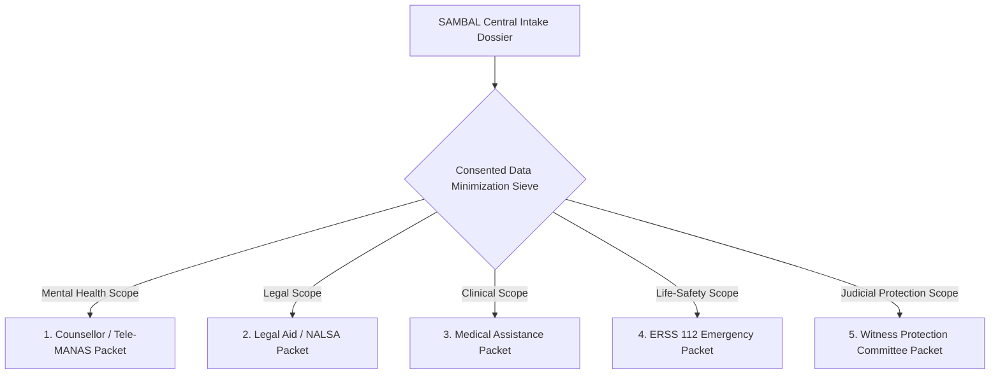
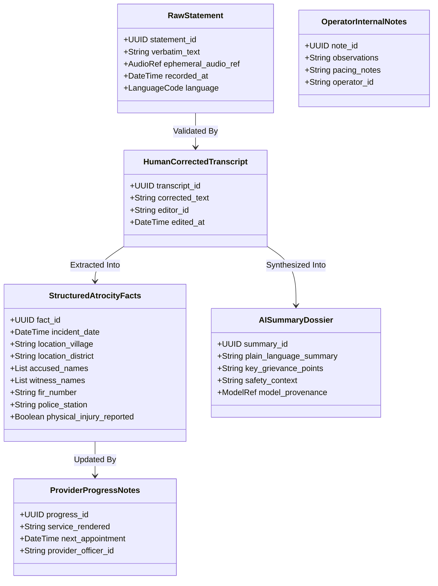

# SAMBAL Product Specification — Safe Handoff & Never-Repeat-My-Story

> **Packet ID:** PKT-02  
> **Status:** AUTHORITATIVE SPECIFICATION  
> **Last Updated:** 2026-10-03  
> **Traceability:** DPDP Act 2023 Principles, Trauma-Informed Systems  

---

## 1. Executive Summary & Purpose

A major source of secondary trauma for victims of atrocities and sexual violence is **forced narrative repetition**—being made to retell harrowing personal experiences to every new agency (call center, police, doctor, legal aid lawyer, social worker). Conversely, uncurated data dumps expose sensitive medical, psychological, and personal information to unauthorized recipients.

SAMBAL solves this through two interdependent architectural mechanisms:
1. **Role-Based Safe Handoff Dossiers:** Strict data minimization ensuring each receiving agency gets only the exact information needed to deliver their specific service.
2. **Never-Repeat-My-Story Multi-Layer Memory:** An immutable, structured fact repository that distinguishes raw citizen disclosures, human-corrected transcripts, structured entities, AI summaries, and professional case notes.

---

## 2. Role-Based Safe Handoff Dossiers (Data Minimization per Service)

---

### 1. Counsellor / Tele-MANAS Handoff Packet (`ROLE_SUPPORT_COUNSELLOR`)
- **Permitted / Included Information:**
  - Citizen preferred language and safe callback window.
  - Consented psychosocial distress summary (e.g. panic symptoms, insomnia, acute grief).
  - Immediate Safety State (`NO_IMMEDIATE_SIGNAL`, `REVIEW_RECOMMENDED`, `CRITICAL_REVIEW`).
  - Known personal support network (family present, living alone).
  - Complainant's consented core narrative excerpt.
- **Strictly Excluded / Redacted:**
  - Complete police FIR draft or court evidence.
  - Accused perpetrator identification details (names, caste sub-identities, property records).
  - Raw audio WAV/PCM files.
  - Internal technical ML confidence scores or acoustic feature vectors.

---

### 2. Legal Aid / NALSA Handoff Packet (`ROLE_LEGAL_AID_ADVOCATE`)
- **Permitted / Included Information:**
  - Date, time, village, and district of alleged atrocity.
  - Specific nature of incident (assault, land dispossession, caste slur in public, arson).
  - Identified accused individuals and known eyewitness names.
  - Police station details and FIR registration status (FIR number or station refusal).
  - Rule 12 statutory compensation status and immediate relief needs.
  - Complainant contact details and safe consultation preferences.
- **Strictly Excluded / Redacted:**
  - Confidential mental health session notes or therapeutic disclosures.
  - Raw acoustic voice tremor or pitch variance telemetry (inadmissible in court and potentially prejudicial).
  - Unconsented third-party disclosures.

---

### 3. Medical Assistance Handoff Packet (`ROLE_MEDICAL_SUPPORT_USER`)
- **Permitted / Included Information:**
  - Reported physical injuries, bleeding, fractures, burns, sexual assault indicators.
  - Need for emergency transport / ambulance dispatch.
  - Patient physical location and emergency contact.
  - Relevant pre-existing medical vulnerabilities (pregnancy, disability, chronic illness).
- **Strictly Excluded / Redacted:**
  - Full legal dispute history, land ownership records, or civil litigation details.
  - Psychological profiling or SVI scores.

---

### 4. ERSS 112 Emergency Handoff Packet (`HUMAN_AUTHORIZED_EMERGENCY_HANDOFF`)
- **Permitted / Included Information:**
  - Exact reported physical location (GPS coordinates if available, landmark, village, police station jurisdiction).
  - Imminent physical threat description (e.g. armed mob, weapons brandished, active arson).
  - Number of persons at immediate risk.
  - Verified caller contact phone number.
- **Strictly Excluded / Redacted:**
  - Entire historical grievance history or unrelated civil disputes.
  - Historical counselling transcripts or psychological evaluations.

---

### 5. Witness Protection Review Packet (`ROLE_DISTRICT_NODAL_OFFICER`)
- **Permitted / Included Information:**
  - Threat Assessment Summary: Specific threats received, date/time, medium (verbal, phone, physical stalking).
  - Criminal case reference: FIR number, Special Court case number, trial stage.
  - Accused details: Names, bail status, proximity of residence to witness.
  - Specific protection measures requested (police escort, identity shielding, relocation).
- **Strictly Excluded / Redacted:**
  - Private counselling therapy notes.

---

## 3. Never-Repeat-My-Story Specification

To eliminate the torture of repeated retellings, the system maintains a structured, auditable fact repository where different levels of information are strictly segregated:

### Operational Rules of Never-Repeat-My-Story:
1. **Verification Before Interrogation:** When an assigned partner agency (e.g. legal aid advocate) contacts the victim, their screen opens with the **Structured Fact Dossier** and **Verified Summary**. The advocate begins with confirmation (*"I have your statement here regarding the incident on October 2nd at village Rampur; I see you need assistance opposing the bail plea..."*) rather than re-asking *"Tell me what happened from the beginning."*
2. **Citizen-Controlled Narrative Additions:** If the citizen wishes to add or correct details, they can do so; new additions are appended as versioned amendments without erasing the verified core.
3. **Immutable Provenance:** Any field modified by an operator or lawyer records their digital signature. An AI summary can never overwrite citizen testimony.
