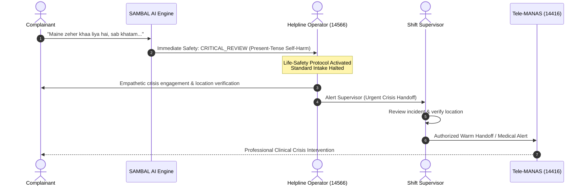

# SAMBAL Product Policy — Self-Harm & Suicide Safety Policy

> **Packet ID:** PKT-02  
> **Status:** AUTHORITATIVE SAFETY POLICY  
> **Last Updated:** 2026-10-03  
> **Traceability:** SIH26093 Life-Safety Requirements, Tele-MANAS Protocol Standards  

---

## 1. Foundational Doctrine & Non-Diagnostic Principle

Helpline callers reporting caste-based discrimination, physical violence, humiliation, and institutional neglect frequently experience profound psychological distress, hopelessness, and acute suicidal crisis.

SAMBAL enforces a rigorous, trauma-informed self-harm and suicide triage protocol anchored on three non-negotiable doctrines:

1. **NON-DIAGNOSTIC PRINCIPLE:** SAMBAL is a triage intelligence layer, NOT a psychiatric diagnostic tool. The system shall NEVER assign medical labels (e.g., "Major Depressive Disorder", "Active Suicidality Disorder", "Psychotic Episode"). It evaluates strictly whether an individual requires urgent human mental health support right now.
2. **ZERO AI-ONLY EMERGENCY DISPATCH:** The system is fundamentally prohibited from autonomously initiating police, ambulance, or psychiatric emergency dispatch. Every emergency handoff requires live human operator engagement and supervisor authorization.
3. **CLINICAL INSTRUMENT GOVERNANCE:** Formal screening scales (such as C-SSRS or PHQ-9) cannot be casually rewritten, paraphrased, or synthesized by an LLM. Any screening instrument incorporated into the platform must undergo:
   - Rigorous copyright and licensing clearance.
   - Clinical scope and applicability review by licensed psychiatric advisors.
   - Empirical translation and cultural validity review across Indic languages.
   - Domain expert approval prior to operator deployment.

---

## 2. Context Semantics Taxonomy

To prevent disastrous false alarms (e.g., treating historical recovery as an active emergency) and fatal omissions (e.g., missing disguised suicidal intent), SAMBAL enforces a strict linguistic **Context Semantics Taxonomy**:

```mermaid
graph TD
    Input[Transcript / Text Utterance] --> Parser{Context Semantics Engine}
    
    Parser -->|Present-Tense Self| A[Category 1: Present-Tense Explicit Ideation<br/>Immediate Safety: CRITICAL_REVIEW]
    Parser -->|Passive / Ambiguous| B[Category 2: Passive Hopelessness / Ambiguous<br/>Immediate Safety: REVIEW_RECOMMENDED]
    Parser -->|Historical Self| C[Category 3: Historical / Past Ideation<br/>Immediate Safety: NO_IMMEDIATE_SIGNAL / REVIEW]
    Parser -->|Explicit Negation| D[Category 4: Negated Ideation<br/>Immediate Safety: NO_IMMEDIATE_SIGNAL]
    Parser -->|Third-Party Referent| E[Category 5: Third-Party Ideation<br/>Immediate Safety: Dependent on Third-Party Risk]
    Parser -->|Quoted / External Speech| F[Category 6: Quoted Speech / External Threat<br/>Immediate Safety: ELEVATED (External Threat)]
    Parser -->|Degraded Audio / Unclear| G[Category 7: Unclear Transcription<br/>Immediate Safety: INSUFFICIENT_INFORMATION]
```

---

### Category 1: Present-Tense Explicit Ideation
- **Definition:** Direct, first-person statement expressing immediate intention, plan, or active attempt to end one's life.
- **Linguistic Examples:**
  - *"I want to kill myself right now."*
  - *"Maine zeher khaa liya hai."* (I have consumed poison.)
  - *"I am standing on the railway bridge, I have no reason to live."*
- **Immediate Safety State:** **`CRITICAL_REVIEW`**
- **SVI Impact:** **`CRITICAL`**
- **System Action:**
  - Fires persistent Tier-1 operator alert.
  - Automatically presents approved Tele-MANAS crisis de-escalation prompt.
  - Prompts supervisor notification buzzer.
  - Inhibits standard administrative intake forms to prioritize live human engagement.

---

### Category 2: Passive Hopelessness & Ambiguous Ideation
- **Definition:** Expressions of deep existential weariness, wishing not to wake up, feeling like a burden, but without explicit present-tense suicide declaration.
- **Linguistic Examples:**
  - *"It would be better if I were dead."*
  - *"I don't know why I keep trying, everything is over for me."*
  - *"Meri zindagi ka koi matlab nahi bacha."* (There is no meaning left in my life.)
- **Immediate Safety State:** **`REVIEW_RECOMMENDED`**
- **SVI Impact:** **`HIGH`**
- **System Action:**
  - Surfaces inline indicator to operator: `PASSIVE HOPELESSNESS DETECTED`.
  - Recommends an approved, gentle clarifying template: *"You mentioned feeling overwhelmed; would it be helpful to talk with a supportive counsellor today?"*
  - Does NOT trigger emergency dispatch or alarm sirens.

---

### Category 3: Historical / Resolved Ideation
- **Definition:** First-person statement referring to past suicidal thoughts or previous attempts that are clearly situated in the past, where the caller is currently seeking help or recounting past history.
- **Linguistic Examples:**
  - *"Last year, after they beat my father, I felt like ending my life, but now I want justice."*
  - *"I used to feel suicidal when the police refused our complaint."*
  - *"Pehle mai sochtatha mar jaoon, par ab mai ladna chahtahoon."*
- **Immediate Safety State:** **`NO_IMMEDIATE_SIGNAL`** (or **`REVIEW_RECOMMENDED`** if ongoing trauma indicators are high).
- **SVI Impact:** **`MODERATE`** or **`HIGH`** (indicates cumulative historical trauma).
- **System Action:**
  - Flags historical trauma to operator.
  - Strictly prohibits triggering active suicide de-escalation protocols or dispatching emergency services.
  - Focuses on legal and psychological support referrals.

---

### Category 4: Negated Ideation
- **Definition:** First-person statement explicitly denying suicidal ideation or self-harm intent, often in response to an operator check or as part of a defiant statement.
- **Linguistic Examples:**
  - *"I am not thinking about hurting myself."*
  - *"Chahe kitna bhi sitam ho, mai maroonga nahi, insaaf loonga."* (No matter how much oppression occurs, I will not die; I will get justice.)
  - *"No, I have children to take care of, I am not suicidal."*
- **Immediate Safety State:** **`NO_IMMEDIATE_SIGNAL`**
- **SVI Impact:** Evaluated independently on overall grievance facts (often resilience indicator).
- **System Action:**
  - Prevents false-positive distress flagging triggered by individual keywords like "die", "hurt", or "suicide".
  - Confirms negation in the Evidence Inspector: `NEGATED SELF-HARM INTENT`.

---

### Category 5: Third-Party Ideation
- **Definition:** Statements reporting suicidal ideation, distress, or self-harm attempts by someone other than the caller (e.g. child, spouse, sibling, neighbor).
- **Linguistic Examples:**
  - *"My brother said he wants to die because of this harassment."*
  - *"Meri beti ro rokar keh rahi hai wo zeher khaa legi."* (My daughter is crying and saying she will consume poison.)
- **Immediate Safety State:** Evaluated for the third party (e.g. **`REVIEW_RECOMMENDED`** or **`ELEVATED`** for third-party dependent).
- **System Action:**
  - Flags third-party at risk.
  - Prompts operator to capture third party's location and immediate safety status.
  - Avoids conflating third-party threat with caller's personal immediate self-harm risk.

---

### Category 6: Quoted Speech & External Threats
- **Definition:** Words containing lethal vocabulary used to report what an accused perpetrator said, rather than self-harm.
- **Linguistic Examples:**
  - *"He pointed a gun and said 'I will kill you'."*
  - *"Un logon ne kaha tujhe jaan se maar denge."* (Those people said they will kill you.)
- **Immediate Safety State:** **`ELEVATED`** or **`CRITICAL_REVIEW`** (Categorized under **EXTERNAL THREAT / VIOLENCE**, NOT self-harm).
- **SVI Impact:** **`HIGH`**
- **System Action:**
  - Correctly routes evidence to **Reported Incident Urgency** and **External Threat Policy**.
  - Does NOT trigger suicide helpline routing; triggers legal protection / police handoff review.

---

### Category 7: Unclear Transcription / Audio Glitch
- **Definition:** ASR output produces broken or phonetically ambiguous fragments containing suicide-adjacent terms under low confidence.
- **Linguistic Examples:**
  - Text: *"I want ... die ... today"* (ASR confidence: 0.28, SNR: 4 dB, speaker talking about a *dairy* farm or *dastavej* documents).
- **Immediate Safety State:** **`INSUFFICIENT_INFORMATION`**
- **System Action:**
  - Suppresses automated classification.
  - Alerts operator: `UNCERTAIN TRANSCRIPTION — VERIFY VERBALLY`.
  - Operator verifies caller's actual words before any safety decision is registered.

---

## 3. Human Review & Crisis Escalation Protocol



### Protocol Guidelines:
1. **Never Disconnect:** The operator shall remain on the line with the complainant throughout the crisis escalation.
2. **Supervisor Co-Presence:** The supervisor listens to the live call to verify location and coordinate emergency resources while the operator continues de-escalation.
3. **Tele-MANAS Warm Transfer:** Where feasible, a warm conference call is established with a licensed Tele-MANAS crisis counsellor at 14416.
4. **Audit Immutability:** The entire chain of events—original detection, operator confirmation, supervisor authorization, and handoff timestamp—is permanently logged in the encrypted audit trail.
