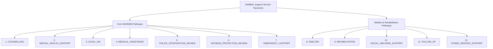

# SAMBAL Product Specification — Support Service Taxonomy & Official Baselines

> **Packet ID:** PKT-02  
> **Status:** AUTHORITATIVE SPECIFICATION  
> **Last Updated:** 2026-10-03  
> **Traceability:** SIH26093 Core Outcomes, MoSJE Schemes, PoA Act Rules 1995  

---

## 1. Executive Summary & Taxonomy Principle

SAMBAL bridges the critical gap between atrocity grievance reporting and tangible, verified support delivery. When an aggrieved citizen contacts NHAA (14566), identifying trauma or distress is useless unless it connects to actionable, verified public institutions.

To ensure architectural discipline, SAMBAL defines a closed, comprehensive **Support Service Taxonomy** explicitly covering all SIH26093 expected recommendation pathways while anchoring them to verified, official Indian public infrastructure.

---

## 2. Complete Support Service Taxonomy

The taxonomy contains exactly 12 standardized service categories divided into Core SIH Pathways and Essential Rehabilitation Pathways:



---

### Core SIH26093 Pathways

#### 1. `COUNSELLING`
- **Scope:** Frontline psychosocial support, grief counselling, crisis de-escalation, emotional stabilization, and trauma-informed supportive listening.
- **Primary Delivery Partner:** Tele-MANAS Tier-1 counsellors, District Mental Health Program (DMHP) counsellors, accredited NGO mental health workers.
- **Trigger Conditions:** SVI elevated (`MODERATE`, `HIGH`, `CRITICAL`), acute grief, family distress, panic or anxiety symptoms during call.

#### 2. `MENTAL_HEALTH_SUPPORT`
- **Scope:** Specialized clinical psychiatric care, clinical psychological evaluation, PTSD therapy, psychiatric medication review, suicide prevention intervention.
- **Primary Delivery Partner:** Tele-MANAS Tier-2 clinical cells (NIMHANS, state mental health institutes), District Civil Hospital Psychiatry Departments.
- **Trigger Conditions:** Immediate Safety `CRITICAL_REVIEW` (self-harm), chronic trauma symptoms, severe functional impairment, passive hopelessness.

#### 3. `LEGAL_AID`
- **Scope:** Free legal representation, FIR drafting, bail opposition petitions, Special Court proceedings under SC/ST (PoA) Act, compensation claims under PoA Rule 12.
- **Primary Delivery Partner:** National Legal Services Authority (NALSA - 15100), State Legal Services Authorities (SLSA), District Legal Services Authorities (DLSA), Taluka Legal Services Committees (TLSC).
- **Statutory Authority:** Section 12(b) of the Legal Services Authorities Act, 1987 (explicitly entitles all SC/ST citizens to free legal aid regardless of income).
- **Trigger Conditions:** Any reported atrocity, unregistered FIR, impending court hearing, accused seeking bail, denial of statutory rights.

#### 4. `MEDICAL_ASSISTANCE`
- **Scope:** Emergency medical care, Medico-Legal Case (MLC) documentation, injury treatment, physical trauma stabilization, forensic examination in sexual assault cases.
- **Primary Delivery Partner:** District Civil Hospitals, Community Health Centres (CHCs), Government Medical College Hospitals.
- **Statutory Authority:** Section 15A(11) of PoA Act & Rule 12(1) (mandates immediate medical examination and free medical treatment).
- **Trigger Conditions:** Reported physical battery, bleeding, burns, poisoning, fractures, or sexual violence.

#### 5. `POLICE_INTERVENTION_REVIEW`
- **Scope:** Formal review of police protection needs, FIR registration verification, protection against physical intimidation, monitoring Special Investigation Officer appointment.
- **Primary Delivery Partner:** District Superintendent of Police (SP), Special Officer under PoA Rule 10, District Crime Branch / SC/ST Protection Cell.
- **Operational Model:** Modeled strictly as an authorized administrative review, NEVER automated direct police dispatch.
- **Trigger Conditions:** Active threats by perpetrators, refusal of local police station to register FIR, ongoing social boycott.

#### 6. `WITNESS_PROTECTION_REVIEW`
- **Scope:** Formal threat assessment and protection measures under the statutory Witness Protection framework.
- **Primary Delivery Partner:** District Witness Protection Committee (headed by District & Sessions Judge, with District Magistrate and SP as members).
- **Statutory Authority:** Witness Protection Scheme, 2018 (approved by Hon'ble Supreme Court in *Mahender Chawla v. Union of India*).
- **Operational Model:** Formal application drafting and submission to the competent District Committee. The AI NEVER grants witness protection; it surfaces the need for authorized judicial review.
- **Trigger Conditions:** Intimidation of eyewitnesses, threats to complainant to turn hostile in Special Court, accused out on bail living near witness.

#### 7. `EMERGENCY_SUPPORT`
- **Scope:** Immediate multi-agency emergency rescue when human life is in imminent peril.
- **Primary Delivery Partner:** Emergency Response Support System (ERSS - 112).
- **Operational Model:** Human-authorized emergency conference call or electronic dispatch handoff coordinated by the shift supervisor.
- **Trigger Conditions:** Immediate Safety `CRITICAL_REVIEW` (ongoing physical assault, arson, hostage situation).

---

### Essential Rehabilitation & Welfare Pathways

#### 8. `SHELTER`
- **Scope:** Immediate safe temporary housing, emergency shelter homes, One Stop Centres (OSC) for women survivors, transit accommodation.
- **Primary Delivery Partner:** District Social Welfare Department, Swadhar Greh, One Stop Centres.
- **Trigger Conditions:** Complainant rendered homeless due to arson, eviction, or fear of returning to village.

#### 9. `REHABILITATION`
- **Scope:** Statutory economic and social rehabilitation under PoA Rule 15 and Rule 12 (employment assistance, agricultural land allocation, housing reconstruction).
- **Primary Delivery Partner:** District Magistrate / Collector, State Social Justice Department.
- **Trigger Conditions:** Severe atrocities resulting in death, disability, or destruction of livelihood.

#### 10. `SOCIAL_WELFARE_SUPPORT`
- **Scope:** Expedited access to scholarships, pension schemes, Dr. Ambedkar National Relief Scheme, and interim cash relief under PoA Rule 12(4).
- **Primary Delivery Partner:** District Social Welfare Officer, Block Development Officer (BDO).
- **Trigger Conditions:** Acute economic deprivation following caste victimization.

#### 11. `FOLLOW_UP`
- **Scope:** Scheduled check-ins by the helpline to verify service delivery, assess ongoing safety, and verify victim well-being.
- **Primary Delivery Partner:** SAMBAL Follow-up Desk / Autonomous outbound IVR (consented).
- **Trigger Conditions:** Triggered automatically post-referral based on configurable urgency policies.

#### 12. `OTHER_VERIFIED_SUPPORT`
- **Scope:** Specialized community-based assistance, sign language interpretation, assistive devices for disabled victims.
- **Primary Delivery Partner:** Empaneled, verified civil society organizations.

---

## 3. Official Verified Public Service Baselines

Every public service pathway incorporated into SAMBAL must be verified against current official Government of India sources:

```text
┌─────────────────────────────────────────────────────────────────────────────┐
│ 1. EMERGENCY RESPONSE SUPPORT SYSTEM (ERSS 112)                             │
│ Jurisdiction: Pan-India (All 36 States & UTs)                               │
│ Primary Channel: 112 (Voice, SMS, 112 India App)                            │
│ Mandate: Unified emergency call center for Police, Fire, Ambulance, Disaster │
│ SAMBAL Integration Pattern: HUMAN_AUTHORIZED_EMERGENCY_HANDOFF              │
│ Status: ADAPTER_READY (Future sandbox; zero mock live calls)                 │
└─────────────────────────────────────────────────────────────────────────────┘

┌─────────────────────────────────────────────────────────────────────────────┐
│ 2. TELE-MANAS (Tele Mental Health Assistance and Networking Across States)   │
│ Primary Channel: Toll-Free 14416 / 1800-891-4416                            │
│ Infrastructure: Apex Centre at NIMHANS; 53 Tele-MANAS Cells in 36 States    │
│ Linguistic Reach: 20 Indian Languages                                       │
│ SAMBAL Integration Pattern: CONSENTED_WARM_TRANSFER & REFERRAL PACKET        │
│ Status: ADAPTER_READY (Verified public baseline)                             │
└─────────────────────────────────────────────────────────────────────────────┘

┌─────────────────────────────────────────────────────────────────────────────┐
│ 3. NATIONAL LEGAL SERVICES AUTHORITY (NALSA 15100)                          │
│ Primary Channel: National Legal Aid Toll-Free 15100                         │
│ Hierarchy: NALSA (Apex) → SLSA (State) → DLSA (District) → TLSC (Taluka)    │
│ Statutory Entitlement: Sec 12(b) of LSA Act 1987 (Free aid for SC/ST)       │
│ SAMBAL Integration Pattern: CONSENTED_FACT_DOSSIER_HANDOFF                  │
│ Status: ADAPTER_READY (Directory-mapped)                                    │
└─────────────────────────────────────────────────────────────────────────────┘

┌─────────────────────────────────────────────────────────────────────────────┐
│ 4. STATUTORY ATROCITY NODAL INFRASTRUCTURE (PoA ACT 1989 / RULES 1995)       │
│ Administrative Desk: District Magistrate / District Nodal Officer (Rule 9) │
│ Investigating Agency: Officer not below DSP rank (Rule 7)                   │
│ Relief Mandate: Mandatory interim relief within 7 days (Rule 12(4))         │
│ Judicial Forum: Exclusive Special Courts / Designated Atrocity Courts       │
│ Witness Protection: District Witness Protection Committee                   │
│ SAMBAL Integration Pattern: OFFICIAL_GOVERNMENT_PORTAL_INTEROP (NHAA 14566) │
│ Status: ADAPTER_READY (Canonical adapter framework)                         │
└─────────────────────────────────────────────────────────────────────────────┘
```

---

## 4. Service Source Freshness & Registry Standards

Helplines frequently fail because directory numbers become obsolete or local contact officers transfer without updates. SAMBAL enforces a strict **Freshness Policy** for every directory record:

### 4.1 Required Metadata Schema per Resource
Every service resource in the internal directory must maintain:
```typescript
interface ServiceResourceRecord {
  resource_id: string;
  service_type: SupportServiceType;
  provider_name: string;
  jurisdiction_state: string;
  jurisdiction_district: string;
  contact_channel: "VOICE" | "IVR" | "REST_API" | "EMAIL" | "PHYSICAL";
  contact_endpoint: string;
  supported_languages: string[];
  last_verified_at: string; // ISO 8601 UTC
  verified_by: string;      // Officer ID
  freshness_status: ServiceFreshnessStatus;
  capacity_status: "AVAILABLE" | "CONGESTED" | "OFFLINE" | "UNKNOWN";
  integration_status: "LIVE" | "ADAPTER_READY" | "SANDBOX";
}
```

### 4.2 Freshness Status Definitions
- **`VERIFIED_CURRENT`:** Endpoint verified within the last 30 days by direct ping, administrative check, or test call. Permitted for primary routing.
- **`STALE`:** Endpoint has not been verified within 30 days. Operator is warned: `WARNING: CONTACT DETAILS MAY BE OUTDATED`.
- **`UNKNOWN`:** Unverified record imported from legacy directories; requires operator manual confirmation before dispatch.
- **`SANDBOX`:** Mock test adapter used in development, training, and judge evaluations.
- **`ADAPTER_READY`:** Clean software interface implemented; waiting for production credentials / government network peering.
- **`LIVE`:** Production API or telephony trunk actively connected.
