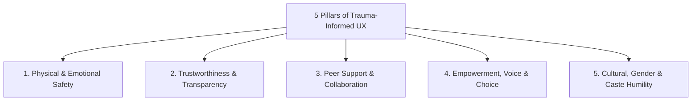

# SAMBAL Product Specification — Trauma-Informed UX & Civic Calm Design System

> **Packet ID:** PKT-02  
> **Status:** AUTHORITATIVE UX SPECIFICATION  
> **Last Updated:** 2026-10-03  
> **Traceability:** Civic Calm Design System Tokens, GIGW 3.0 / WCAG 2.1 AA Standards  

---

## 1. Foundational Philosophy: Civic Calm

Trauma is not merely an emotional memory; it is a profound neurobiological state. When an individual experiences systemic caste violence, threat of physical harm, or severe institutional betrayal, their nervous system enters high sympathetic arousal (fight, flight, freeze, or fawn).

In this state:
- Working memory is severely constricted.
- Ambiguous or bureaucratic language induces intense suspicion and withdrawal.
- Aggressive visual stimuli (harsh red banners, blinking countdowns, loud alert sounds) trigger panic and acute re-traumatization.

SAMBAL establishes the **Civic Calm Design System**—a trauma-informed user experience standard engineered specifically for public welfare and crisis intervention interfaces.

---

## 2. The 5 Pillars of Trauma-Informed UX

### Pillar 1: Physical & Emotional Safety
- **Physical Concealment:** The Silent Distress mode and Quick Exit mechanisms protect the user from physical retaliation by perpetrators who may be in the same dwelling.
- **Predictable Interactions:** Every screen clearly indicates what will happen next before an action is taken. Zero unexpected popups, zero sudden audio blares.
- **Safe Tone:** Interfaces never scold, reprimand, or display harsh validation errors (e.g. replacing red *"INVALID INPUT"* with gentle *"Please check this phone number"*).

### Pillar 2: Trustworthiness & Transparency
- **No Deceptive Dark Patterns:** The system never tricks users into surrendering data or forces consent bundling.
- **Clarity on AI Presence:** Citizens are told clearly: *"This tool helps our human team understand your words faster. A trained person makes all final decisions."*
- **Visible Privacy Boundaries:** Explicitly discloses who will see the complaint before the citizen clicks submit.

### Pillar 3: Peer Support & Collaboration
- **Warm, Non-Hierarchical Tone:** Replaces cold bureaucratic phrasing with empathetic, respectful language.
- **Supportive Pacing:** The interface allows citizens to pause, save drafts, and resume when they feel emotionally ready.

### Pillar 4: Empowerment, Voice & Choice
- **Channel Autonomy:** Citizens choose how to communicate: Speak, Write, or Tap silently.
- **Voluntary Disclosures:** Questions are framed non-coercively; users can skip traumatic details without forfeiting access to basic emergency protection.
- **Reversible Decisions:** Citizens can revoke referral consent or change preferred contact channels at any time.

### Pillar 5: Cultural, Gender & Caste Humility
- **Dignified Representation:** Avoids patronizing, stereotyping, or victim-blaming imagery.
- **Language Inclusivity:** Native script support with colloquial and dialectal tolerance; never scolds for grammatical non-standard speech.

---

## 3. Visual & Sensory Architecture (Civic Calm Tokens)

### 3.1 Color Palette Governance
The interface strictly avoids hyper-saturated, anxiety-inducing primary colors:

| Token Name | Hex Code | Purpose | Emotional Impact |
| :--- | :---: | :--- | :--- |
| `--color-surface-calm` | `#F8FAFC` | Main application background | Serene, neutral, low visual glare |
| `--color-text-primary` | `#0F172A` | Primary typography | High contrast (14.2:1 against surface), maximum legibility |
| `--color-text-secondary`| `#475569` | Supporting explanations | Gentle, readable, non-distracting |
| `--color-civic-teal` | `#0D9488` | Primary interactive buttons | Trust, steady guidance, non-alarming |
| `--color-soft-amber` | `#D97706` | Warning / Review Recommended | Attention without panic |
| `--color-cardinal-alert`| `#DC2626` | Operator-only emergency banner | High visibility; **STRICTLY FORBIDDEN on citizen screens** |

### 3.2 Strict Prohibition on Citizen Distress Badges
- **Zero Red Badges for Citizens:** The citizen UI shall NEVER display red alert boxes saying *"CRITICAL RISK"*, *"HIGH VULNERABILITY"*, or *"DANGER LEVEL 90%"*. Such displays induce extreme panic in victims.
- **Calm Reassurance Banners:** On the citizen side, an elevated case displays a reassuring blue/teal banner:
  > *"We have received your grievance. Because of the urgent nature of what you shared, our senior team has been notified to assist you quickly."*

---

## 4. Emergency Concealment & Quick Exit Standards

### 4.1 Quick Exit Mechanism
- **Visibility:** Present on all citizen-facing pages, pinned permanently in the top-right corner.
- **Trigger:** Single tap or click, or keyboard shortcut (`ESC` key).
- **Actions Executed in < 50ms:**
  1. Window immediately navigates to a high-traffic, innocuous public site (`https://www.india.gov.in`).
  2. Clears browser `sessionStorage`, active form state, and DOM inputs.
  3. Replaces browser history entry so the "Back" button does not return to the complaint form.

### 4.2 Silent Distress Mode Concealment
- **Discreet Title:** Browser tab title displays *"Government Services Portal"*.
- **Neutral Icon:** Uses the standard national emblem / generic portal favicon.
- **No Sound Emission:** All HTML5 audio tags and Web Audio API contexts are explicitly muted.
